# Mermaid Diagrams Skill

This skill helps you create and maintain architecture diagrams using Mermaid syntax.

## When to Use This Skill

- Visualizing system architecture
- Documenting data flows and workflows
- Creating database entity-relationship diagrams
- Sequence diagrams for API interactions
- State diagrams for workflows
- Flowcharts for decision logic
- Updating architecture documentation

## Mermaid Overview

Mermaid is a diagramming and charting tool that uses text-based syntax:
- **Text-Based**: Diagrams defined in plain text
- **Version Control**: Track changes in git
- **Easy Updates**: Modify diagrams like code
- **Multiple Types**: Flowcharts, sequence, ER, class, state, etc.
- **Integration**: Works in Markdown, GitHub, and many other platforms

## Diagram Types

### 1. System Architecture (Flowchart)

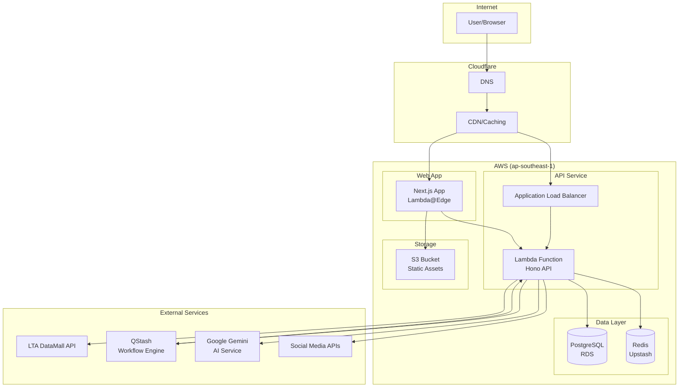

**Source file:**
```
// apps/docs/diagrams/system-architecture.mmd
flowchart TB
    User[User/Browser] --> DNS[Cloudflare DNS]
    DNS --> NextJS[Next.js App]
    // ... rest of diagram
```

### 2. Workflow Sequence Diagram

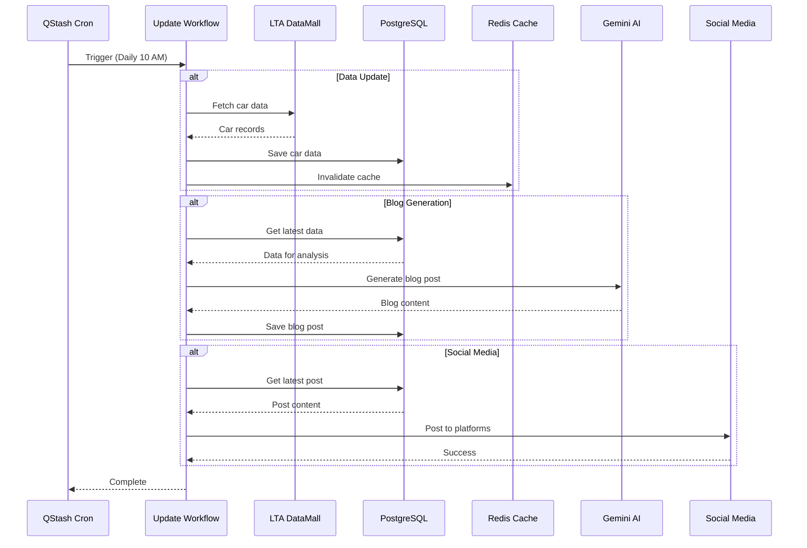

**Source file:**
```
// apps/docs/diagrams/workflow-sequence.mmd
sequenceDiagram
    participant QStash
    participant Workflow
    // ... rest of diagram
```

### 3. Database Entity-Relationship Diagram

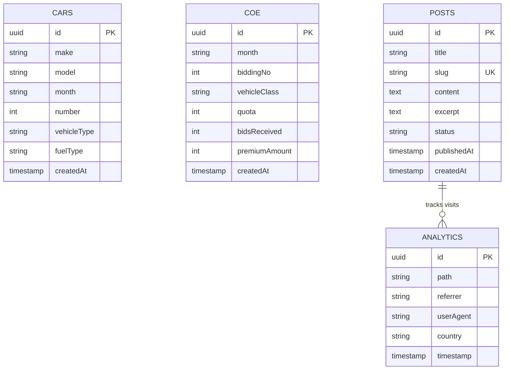

**Source file:**
```
// apps/docs/diagrams/database-erd.mmd
erDiagram
    CARS {
        uuid id PK
        // ... rest of schema
    }
```

### 4. API Architecture

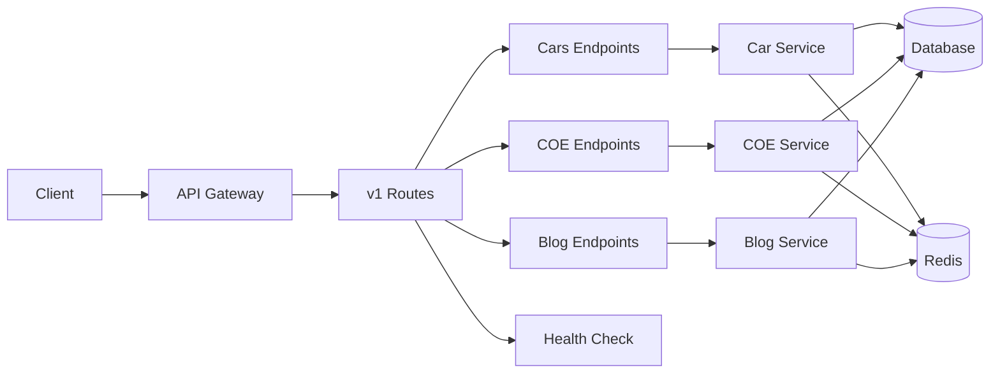

### 5. State Diagram (Workflow States)

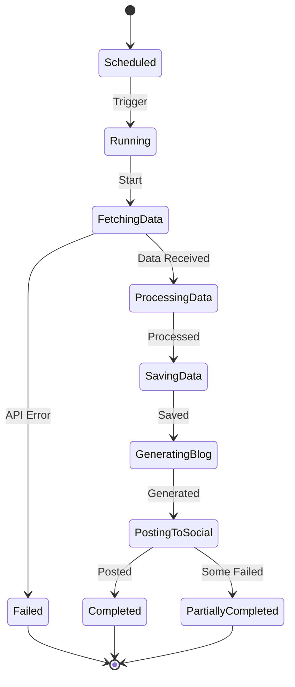

### 6. Class Diagram (TypeScript Interfaces)

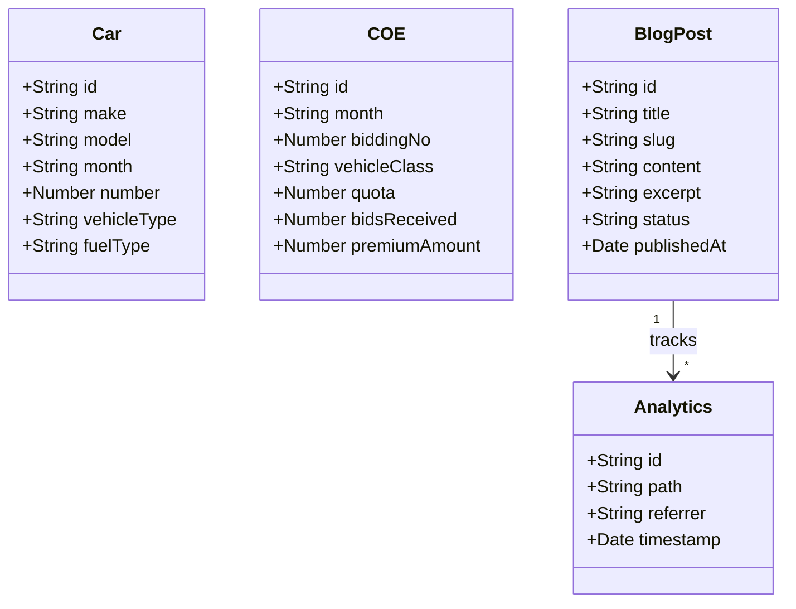

## Creating Diagrams

### File Organization

```
docs/
├── diagrams/                    # Source .mmd files
│   ├── system.mmd
│   ├── workflows.mmd
│   ├── database.mmd
│   ├── api.mmd
│   ├── infrastructure.mmd
│   └── social.mmd
└── architecture/                # Markdown docs with embedded diagrams
    ├── system.md
    ├── workflows.md
    ├── database.md
    ├── api.md
    ├── infrastructure.md
    └── social.md
```

### Embed in Markdown Docs

```markdown
# System Architecture

The system consists of the following components:

```mermaid
flowchart TB
    User[User/Browser] --> DNS[Cloudflare DNS]
    DNS --> NextJS[Next.js App]
    DNS --> API[Hono API]
    // ... rest of diagram
\```

## Components

### Frontend
- Next.js 16 with App Router
- Deployed on AWS Lambda@Edge
- Static assets on S3 + CloudFront

### Backend
- Hono API on AWS Lambda
- PostgreSQL on RDS
- Redis caching with Upstash
```

## Common Patterns

### System Overview

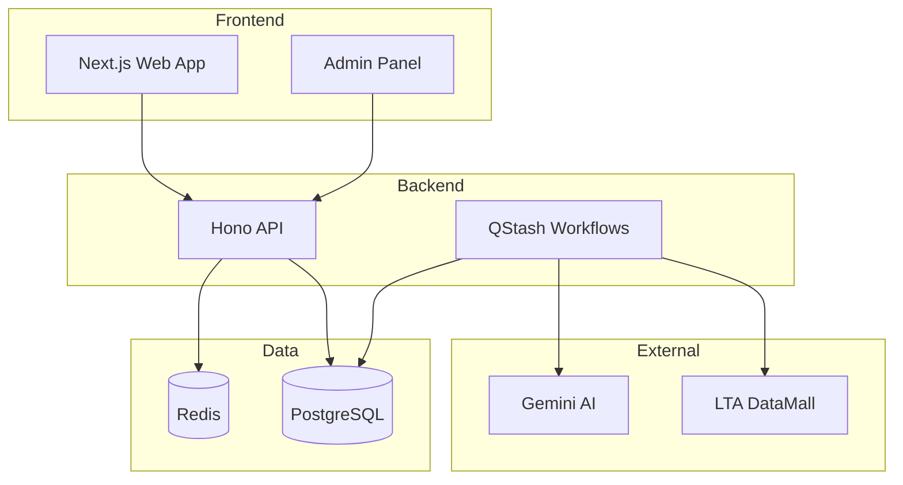

### Data Flow

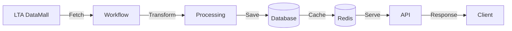

### Request Flow

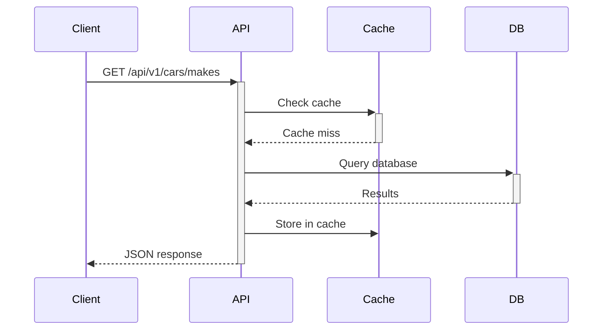

### Deployment Pipeline

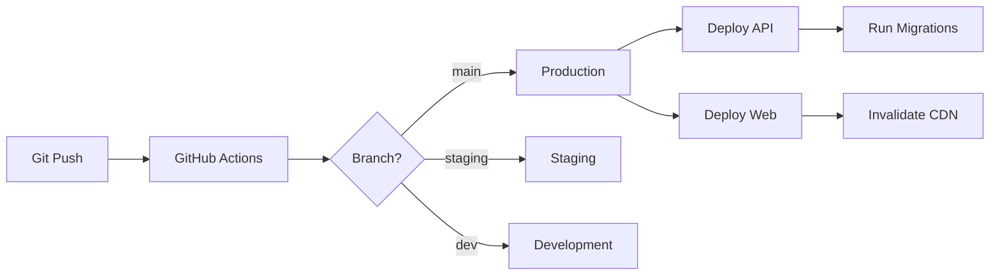

## Styling Diagrams

### Colors and Themes

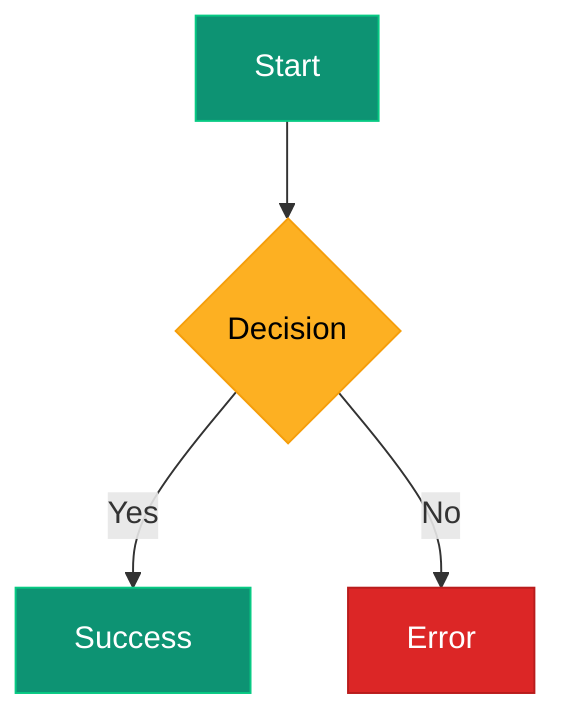

### Subgraphs for Organization

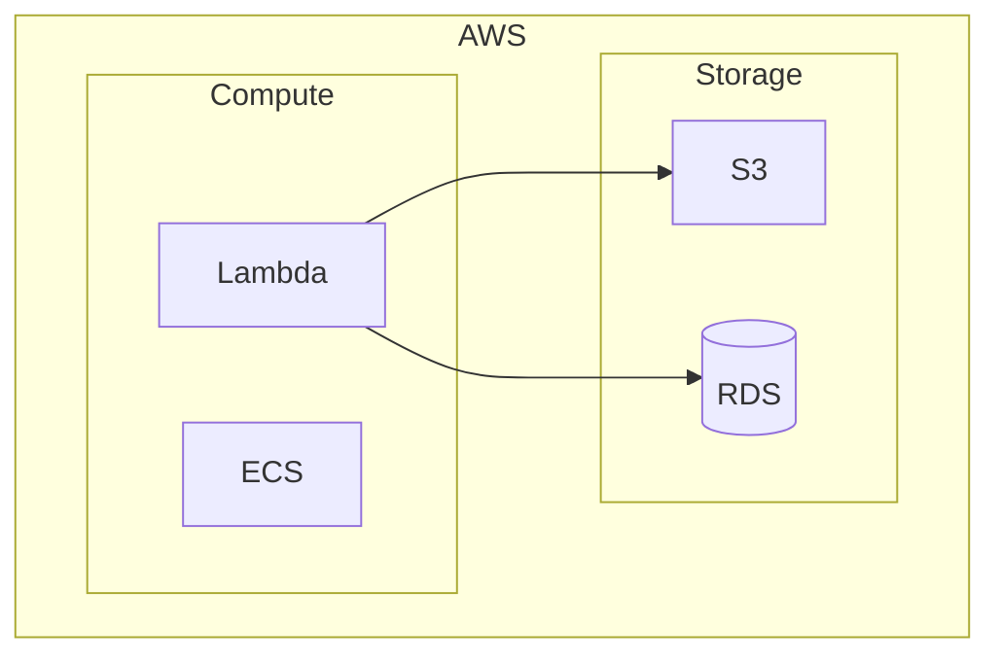

## Best Practices

### 1. Use Meaningful Labels

```mermaid
# ❌ Unclear labels
A --> B
B --> C

# ✅ Clear labels
User[User] --> API[API Gateway]
API --> DB[(Database)]
```

### 2. Group Related Components

```mermaid
# ✅ Organized with subgraphs
flowchart TB
    subgraph Frontend
        Web[Web App]
        Mobile[Mobile App]
    end

    subgraph Backend
        API[API]
        Workers[Workers]
    end

    Web --> API
    Mobile --> API
```

### 3. Add Arrows for Data Flow

```mermaid
# ❌ No direction
A -- B

# ✅ Shows direction
A -->|Request| B
B -->|Response| A
```

### 4. Use Appropriate Diagram Types

- **Flowchart**: System architecture, data flow
- **Sequence**: API interactions, workflows
- **ER Diagram**: Database schemas
- **State**: Workflow states, FSM
- **Class**: TypeScript interfaces, OOP

## Exporting Diagrams

### PNG/SVG Export

```bash
# Install mermaid-cli
pnpm add -g @mermaid-js/mermaid-cli

# Generate PNG
mmdc -i diagram.mmd -o diagram.png

# Generate SVG
mmdc -i diagram.mmd -o diagram.svg

# Generate PDF
mmdc -i diagram.mmd -o diagram.pdf
```

### Batch Export

```bash
# Export all diagrams
for file in diagrams/*.mmd; do
  mmdc -i "$file" -o "${file%.mmd}.png"
done
```

## Updating Diagrams

### Workflow

1. Edit source `.mmd` file in `docs/diagrams/`
2. Update corresponding Markdown file in `docs/architecture/`
3. Preview in GitHub or VS Code
4. Commit changes

```bash
# Edit diagram
vim docs/diagrams/system.mmd

# Update documentation
vim docs/architecture/system.md

# Commit
git add docs/diagrams/system.mmd
git add docs/architecture/system.md
git commit -m "docs: update system architecture diagram"
```

## Troubleshooting

### Syntax Errors

```mermaid
# ❌ Invalid syntax
flowchart TB
    A -> B  # Wrong arrow syntax

# ✅ Correct syntax
flowchart TB
    A --> B
```

### Layout Issues

```mermaid
# ❌ Unclear layout
flowchart LR
    A --> B --> C --> D --> E

# ✅ Better layout with subgraphs
flowchart TB
    A --> B
    B --> C

    subgraph Processing
        C --> D
        D --> E
    end
```

### Diagram Not Rendering

```markdown
# Issue: Mermaid not rendering
# Solution: Ensure proper code fence

# ❌ Wrong
\```mermaid
graph TD
\```

# ✅ Correct
\```mermaid
flowchart TD
    A --> B
\```
```

## Live Editors

### Online Editors

- **Mermaid Live Editor**: https://mermaid.live
- **GitHub**: Renders mermaid in markdown

### VS Code Extensions

```bash
# Install Mermaid extension
# Search: "Mermaid Markdown Syntax Highlighting"
```

## References

- Mermaid Documentation: https://mermaid.js.org
- Flowchart Syntax: https://mermaid.js.org/syntax/flowchart.html
- Sequence Diagrams: https://mermaid.js.org/syntax/sequenceDiagram.html
- ER Diagrams: https://mermaid.js.org/syntax/entityRelationshipDiagram.html
- State Diagrams: https://mermaid.js.org/syntax/stateDiagram.html
- Related files:
  - `docs/diagrams/` - Source diagram files
  - `docs/architecture/` - Documentation with diagrams
  - Root CLAUDE.md - Documentation guidelines

## Best Practices Summary

1. **Source Control**: Keep `.mmd` files in `diagrams/` directory
2. **Meaningful Labels**: Use clear, descriptive node labels
3. **Subgraphs**: Group related components for clarity
4. **Appropriate Types**: Choose the right diagram type for the purpose
5. **Consistent Style**: Use consistent colors and formatting
6. **Data Flow**: Show direction with arrows
7. **Documentation**: Embed diagrams in relevant docs
8. **Keep Updated**: Update diagrams when architecture changes
