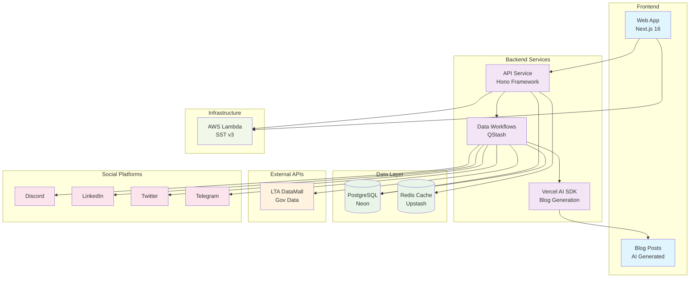

# SG Cars Trends

[](https://opensource.org/licenses/MIT)

## Overview

This monorepo provides a complete platform for SG Cars Trends, tracking Singapore's car registration statistics and Certificate of Entitlement (COE) data. The system includes:

- **Web Application**: Next.js 16 frontend with Cache Components, co-located route components, enhanced homepage featuring latest COE results, interactive charts, analytics, and AI-generated blog content with responsive design
- **REST API**: Hono-based API with type-safe endpoints for car registrations and COE results
- **Integrated Data Updater**: QStash workflow-based system for fetching and processing LTA data
- **LLM Blog Generation**: Automated blog post creation using Vercel AI SDK with Google Gemini for market insights
- **Social Media Integration**: Automated posting to Discord, LinkedIn, Telegram, and Twitter with trackable redirect routes
- **Infrastructure**: SST v3 serverless deployment on AWS with multi-stage environments
- **Documentation**: Comprehensive developer documentation with Mintlify

## System Overview



## Project Structure

```
sgcarstrends/
├── apps/
│   ├── api/          # Unified API service with integrated updater
│   │   ├── src/v1/          # API endpoints for data access
│   │   ├── src/lib/         # Workflows, social media, and LLM blog generation
│   │   ├── src/routes/      # Workflow endpoints and webhooks
│   │   ├── src/trpc/        # Type-safe tRPC router with authentication
│   │   └── src/config/      # Database, Redis, QStash configurations
│   ├── web/          # Next.js 16 frontend application
│   │   ├── src/app/         # Next.js App Router pages and layouts
│   │   │   ├── (social)/    # Social media redirect routes with UTM tracking
│   │   │   └── blog/        # Blog pages with AI-generated content
│   │   ├── src/queries/     # Data fetching queries (cars, COE, logos) with comprehensive tests
│   │   ├── src/actions/     # Server actions (newsletter subscription)
│   │   ├── src/components/  # React components with comprehensive tests
│   │   └── src/utils/       # Web-specific utility functions
│   ├── admin/        # Administrative interface for content management (unreleased)
│   └── docs/         # Mintlify documentation site
│       ├── architecture/     # System architecture documentation with Mermaid diagrams
│       └── diagrams/         # Source Mermaid diagram files (.mmd)
├── packages/
│   ├── database/     # Database schema and migrations (Drizzle ORM)
│   │   ├── src/schema/      # Schema definitions for all tables
│   │   └── migrations/      # Database migration files
│   ├── types/        # Shared TypeScript types
│   ├── ui/           # Shared UI component library (shadcn/ui, Radix UI, Tailwind CSS)
│   │   ├── src/components/  # shadcn/ui components
│   │   ├── src/hooks/       # Custom React hooks
│   │   ├── src/lib/         # Utility functions
│   │   └── src/styles/      # Global styles
│   └── utils/        # Shared utility functions and Redis configuration
├── infra/            # SST v3 infrastructure configuration
│   ├── api.ts              # API service configuration
│   ├── web.ts              # Web application configuration
│   └── router.ts           # Domain routing and DNS management
```

## Technologies

- **Frontend**: Next.js 16 with Cache Components, React 19, TypeScript
- **UI Library**: HeroUI (NextUI successor) with professional design system
- **Styling**: Tailwind CSS v4 with custom configuration
- **Backend**: Node.js 22, TypeScript with strict mode
- **API Framework**: Hono with OpenAPI documentation
- **Database**: Neon Serverless PostgreSQL with Drizzle ORM
- **Caching**: Upstash Redis for API responses and analytics
- **Infrastructure**: SST v3 (Serverless Stack) on AWS
- **Scheduling**: QStash Workflows for data processing
- **LLM Integration**: Vercel AI SDK with Google Gemini for blog content generation
- **Package Management**: pnpm v10.22.0 workspace with catalog for centralised dependency management
- **Build Tools**: Turbopack for fast development builds
- **Testing**: Vitest (unit), Playwright (E2E) with comprehensive coverage
- **Linting & Formatting**: Biome v2.3.0 for consistent code style, formatting, and import organisation

## Documentation

📚 **Complete API documentation is available at: [docs.sgcarstrends.com](https://docs.sgcarstrends.com)**

- **[Getting Started](https://docs.sgcarstrends.com/quickstart)** - Quick start guide and authentication
- **[API Reference](https://docs.sgcarstrends.com/api-reference/overview)** - Complete endpoint documentation
- **[Developer Guides](https://docs.sgcarstrends.com/guides/data-models)** - Data models, filtering, and analytics
- **[Examples](https://docs.sgcarstrends.com/examples/javascript)** - Code examples in multiple languages
- **[Architecture](https://docs.sgcarstrends.com/architecture/system)** - System architecture diagrams and documentation

### Development Documentation

For developers working on this codebase, detailed component-specific guidance is available:

- **[Root CLAUDE.md](CLAUDE.md)** - Overall project guidance and conventions
- **[API Service](apps/api/CLAUDE.md)** - Hono framework, workflows, tRPC, and social media integration
- **[Web Application](apps/web/CLAUDE.md)** - Next.js development, HeroUI components, and blog features
- **[Database Package](packages/database/CLAUDE.md)** - Schema management, migrations, and TypeScript integration
- **[UI Package](packages/ui/CLAUDE.md)** - Shared component library with shadcn/ui and Tailwind CSS
- **[Infrastructure](infra/CLAUDE.md)** - SST deployment, AWS configuration, and domain management

## Getting Started

### Prerequisites

- Node.js >= 22
- pnpm v10.22.0

### Installation

```bash
# Clone the repository
git clone https://github.com/sgcarstrends/sgcarstrends.git
cd sgcarstrends

# Install dependencies
pnpm install
```

#### Dependency Management

This project uses **pnpm catalog** for centralised dependency version management. Shared dependencies (React, Next.js, TypeScript, testing tools, etc.) are defined in `pnpm-workspace.yaml` and referenced by workspace packages using the `catalog:` protocol.

**Key catalog packages:**
- React ecosystem: `react` (19.2.0), `react-dom` (19.2.0), `next` (16.0.0)
- TypeScript & types: `typescript` (5.8.3), `@types/node`, `@types/react` (19.2.0), `@types/react-dom` (19.2.0)
- Testing tools: `vitest` (3.2.4), `@vitest/coverage-v8` (3.2.4)
- Utilities: `date-fns` (3.6.0), `zod` (3.25.76), `resend` (6.1.2), `superjson` (2.2.2)

**Root-level dependencies** (not in catalog):
- Build tools: `sst` (3.17.21), `turbo` (2.5.8)
- Code quality: `@biomejs/biome` (2.3.0), `husky` (9.1.7), `lint-staged` (16.1.5)
- Release management: `semantic-release` (24.0.0)

This ensures version consistency across all workspace packages and simplifies dependency upgrades.

### Development

```bash
# Development
pnpm dev                    # Run all applications in development mode
pnpm dev:api               # API service only
pnpm dev:web               # Web application only
pnpm docs:dev              # Documentation site only

# Build
pnpm build                 # Build all applications
pnpm build:web             # Build web application only
pnpm build:admin           # Build admin interface only

# Testing
pnpm test                  # Run all unit tests
pnpm test:watch            # Run tests in watch mode
pnpm test:coverage         # Run tests with coverage
pnpm test:api              # Run API tests only
pnpm test:web              # Run web tests only

# E2E Testing (Web App)
pnpm -F @sgcarstrends/web test:e2e       # Run Playwright E2E tests
pnpm -F @sgcarstrends/web test:e2e:ui    # Run E2E tests with Playwright UI

# Code Quality
pnpm lint                  # Run Biome linting on all packages
pnpm format                # Run Biome formatting on all packages
pnpm lint:api              # Lint API service only
pnpm lint:web              # Lint web application only
pnpm lint:admin            # Lint admin application only

# Database
pnpm db:migrate            # Run database migrations
pnpm db:migrate:check      # Check migration status
pnpm db:generate           # Generate new migrations
pnpm db:push               # Push schema changes
pnpm db:drop               # Drop database

# Deployment
pnpm deploy:dev            # Deploy all to dev environment
pnpm deploy:staging        # Deploy all to staging environment
pnpm deploy:prod           # Deploy all to production environment

# Service-specific deployment
pnpm deploy:api:dev        # Deploy API to dev
pnpm deploy:web:dev        # Deploy web to dev
```

## API Endpoints

### Public Endpoints
- `GET /` - Scalar API documentation interface
- `GET /docs` - OpenAPI specification
- `GET /health` - Health check endpoint

### Data Access (Authenticated)
- `GET /v1/cars` - Car registration data with filtering
- `GET /v1/coe` - COE bidding results
- `GET /v1/coe/pqp` - COE Prevailing Quota Premium rates
- `GET /v1/makes` - Car manufacturers
- `GET /v1/months/latest` - Latest month with data

### Workflow System (Authenticated)
- `POST /workflows/trigger` - Trigger data update workflows
- `POST /workflows/cars` - Car data processing workflow
- `POST /workflows/coe` - COE data processing workflow
- `POST /workflows/linkedin` - LinkedIn posting webhook
- `POST /workflows/twitter` - Twitter posting webhook
- `POST /workflows/discord` - Discord posting webhook
- `POST /workflows/telegram` - Telegram posting webhook

### tRPC (Authenticated)
- `POST /trpc/*` - Type-safe tRPC procedures with bearer authentication

## Repo Activity


## License

[MIT](LICENSE)
