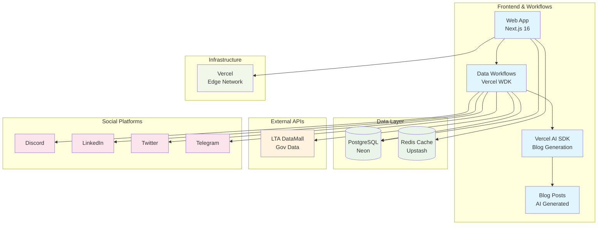

# SG Cars Trends

[](https://opensource.org/licenses/MIT)

## Overview

This monorepo provides a complete platform for SG Cars Trends, tracking Singapore's car registration statistics and Certificate of Entitlement (COE) data. The system includes:

- **Web Application**: Next.js 16 frontend with Cache Components, co-located route components, enhanced homepage featuring latest COE results, interactive charts, analytics, AI-generated blog content, and integrated admin interface at `/admin` path. Also hosts the data updater workflows.
- **Integrated Data Updater**: Vercel WDK workflow-based system for fetching and processing LTA data (consolidated into web application)
- **LLM Blog Generation**: Automated blog post creation using Vercel AI SDK with Google Gemini for market insights (runs within web workflows)
- **Social Media Integration**: Automated posting to Discord, LinkedIn, Telegram, and Twitter with trackable redirect routes (triggered by web workflows)
- **Infrastructure**: Vercel deployment with automatic CI/CD

## System Overview



## Project Structure

```
sgcarstrends/
├── apps/
│   ├── web/          # Next.js 16 frontend application with integrated workflows
│   │   ├── src/app/         # Next.js App Router pages and layouts
│   │   │   ├── (social)/    # Social media redirect routes with UTM tracking
│   │   │   ├── admin/       # Integrated admin interface for content management
│   │   │   ├── blog/        # Blog pages with AI-generated content
│   │   │   └── api/workflows/  # Vercel WDK workflow endpoints
│   │   ├── src/lib/workflows/  # Data updater workflows and social media integration
│   │   ├── src/queries/     # Data fetching queries (cars, COE, logos) with comprehensive tests
│   │   ├── src/actions/     # Server actions (maintenance tasks)
│   │   ├── src/components/  # React components with comprehensive tests
│   │   ├── src/utils/       # Web-specific utility functions
│   │   └── src/config/      # Database, Redis, and platform configurations
├── packages/
│   ├── ai/           # AI-powered blog generation package
│   │   ├── src/generate-post.ts  # 2-step blog generation
│   │   ├── src/schemas.ts        # Zod schemas for structured output
│   │   └── src/instrumentation.ts # Langfuse telemetry
│   ├── database/     # Database schema and migrations (Drizzle ORM)
│   │   ├── src/schema/      # Schema definitions for all tables
│   │   └── migrations/      # Database migration files
│   ├── logos/        # Car logo management with Vercel Blob storage
│   ├── types/        # Shared TypeScript types
│   ├── ui/           # Shared UI component library (shadcn/ui, Radix UI, Tailwind CSS)
│   │   ├── src/components/  # shadcn/ui components
│   │   ├── src/hooks/       # Custom React hooks
│   │   ├── src/lib/         # Utility functions
│   │   └── src/styles/      # Global styles
│   └── utils/        # Shared utility functions and Redis configuration
```

## Technologies

- **Frontend**: Next.js 16.1 with Cache Components, React 19.2, TypeScript 5.8
- **UI Library**: HeroUI (NextUI successor) with professional design system
- **Styling**: Tailwind CSS v4.1 with custom configuration
- **Backend**: Node.js 22, TypeScript with strict mode
- **API Framework**: Hono with OpenAPI documentation
- **Database**: Neon Serverless PostgreSQL with Drizzle ORM
- **Caching**: Upstash Redis for API responses and analytics
- **Infrastructure**: Vercel with automatic deployments
- **Scheduling**: Vercel WDK Workflows with Vercel Cron for data processing
- **LLM Integration**: Vercel AI SDK with Google Gemini for blog content generation
- **Package Management**: pnpm v10.22.0 workspace with catalog for centralised dependency management
- **Build Tools**: Turbo v2.6.3 for monorepo orchestration, Turbopack for fast development builds
- **Testing**: Vitest v4.0.15 (unit), Playwright (E2E) with comprehensive coverage
- **Linting & Formatting**: Biome v2.3.0 for consistent code style, formatting, and import organisation

## Documentation

For developers working on this codebase, detailed component-specific guidance is available:

- **[Root CLAUDE.md](CLAUDE.md)** - Overall project guidance and conventions
- **[Web Application](apps/web/CLAUDE.md)** - Next.js development, HeroUI components, blog features, and data updater workflows
- **[Database Package](packages/database/CLAUDE.md)** - Schema management, migrations, and TypeScript integration
- **[AI Package](packages/ai/CLAUDE.md)** - AI-powered blog generation with Vercel AI SDK and Google Gemini
- **[Logos Package](packages/logos/CLAUDE.md)** - Car logo management with Vercel Blob storage
- **[UI Package](packages/ui/CLAUDE.md)** - Shared component library with shadcn/ui and Tailwind CSS

### Architecture Documentation

System architecture diagrams are available in the `docs/` directory:

- **[docs/architecture/](docs/architecture/)** - Architecture documentation with Mermaid diagrams
- **[docs/diagrams/](docs/diagrams/)** - Source Mermaid diagram files

## Getting Started

### Prerequisites

- Node.js >= 22
- pnpm v10.22.0

### Installation

```bash
# Clone the repository
git clone https://github.com/sgcarstrends/sgcarstrends.git
cd sgcarstrends

# Install dependencies
pnpm install
```

#### Dependency Management

This project uses **pnpm catalog** for centralised dependency version management. Shared dependencies (React, Next.js, TypeScript, testing tools, etc.) are defined in `pnpm-workspace.yaml` and referenced by workspace packages using the `catalog:` protocol.

**Key catalog packages:**
- React ecosystem: `react` (^19.2.3), `react-dom` (^19.2.3), `next` (^16.1.0)
- TypeScript & types: `typescript` (^5.8.3), `@types/node` (^22.16.4), `@types/react` (^19.2.0), `@types/react-dom` (^19.2.0)
- Testing tools: `vitest` (^4.0.15), `@vitest/coverage-v8` (^4.0.15)
- AI & LLM: `ai` (^6.0.1), `@ai-sdk/google` (^3.0.6), `@langfuse/otel` (^4.4.2)
- Utilities: `date-fns` (^3.6.0), `zod` (^4.1.13), `sonner` (2.0.7)

**Root-level dependencies** (not in catalog):
- Build tools: `turbo` (^2.6.3)
- Code quality: `@biomejs/biome` (2.3.0), `husky` (^9.1.7), `lint-staged` (^16.1.5)
- Release management: `semantic-release` (^24.0.0)

This ensures version consistency across all workspace packages and simplifies dependency upgrades.

### Development

```bash
# Development
pnpm dev                    # Run all development servers
pnpm dev:web               # Web application only
cd apps/web && pnpm dev    # Web application development

# Build
pnpm build                 # Build all applications
pnpm build:web             # Build web application only

# Testing
pnpm test                  # Run all unit tests
pnpm test:watch            # Run tests in watch mode
pnpm test:coverage         # Run tests with coverage
pnpm test:web              # Run web tests only
cd apps/web && pnpm test   # Web tests only

# E2E Testing (Web App)
pnpm -F @sgcarstrends/web test:e2e       # Run Playwright E2E tests
pnpm -F @sgcarstrends/web test:e2e:ui    # Run E2E tests with Playwright UI

# Code Quality
pnpm lint                  # Run Biome linting on all packages
pnpm format                # Run Biome formatting on all packages
pnpm lint:web              # Lint web application only
cd apps/web && pnpm lint   # Lint web application only

# Database
pnpm db:migrate            # Run database migrations
pnpm db:migrate:check      # Check migration status
pnpm db:generate           # Generate new migrations
pnpm db:push               # Push schema changes
pnpm db:drop               # Drop database
```

### Deployment

Deployment is handled automatically by Vercel:
- **Production**: Push to `main` branch triggers automatic deployment
- **Preview**: Pull requests get automatic preview deployments

## API Endpoints

### Web Application Workflows (apps/web)

**Workflow Endpoints (Vercel Cron Triggered):**
- `POST /api/workflows/trigger` - Trigger data update workflows
- `POST /api/workflows/cars` - Car data processing workflow
- `POST /api/workflows/coe` - COE data processing workflow
- `POST /api/workflows/deregistrations` - Vehicle deregistration processing workflow
- `POST /api/workflows/regenerate` - Regenerate blog post workflow

## Repo Activity


## License

[MIT](LICENSE)
