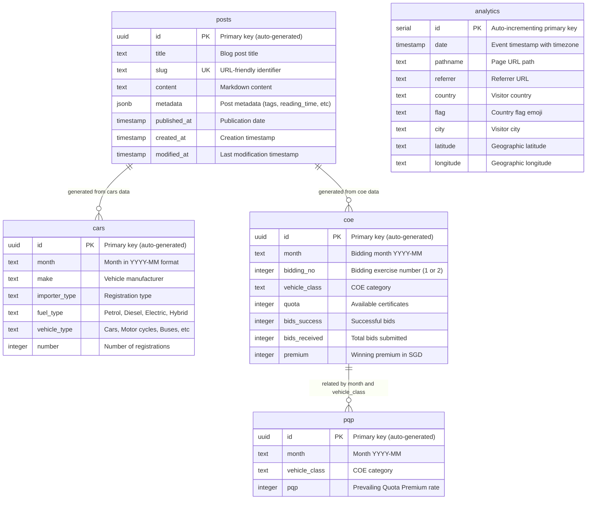

# Database Schema

This document describes the PostgreSQL database schema used by the SG Cars Trends platform, including table structures, relationships, and indexing strategies.

## Entity Relationship Diagram



## Table Specifications

### Cars Table

**Purpose**: Stores monthly vehicle registration data from LTA DataMall

**Table Definition**:
```sql
CREATE TABLE cars (
    id UUID PRIMARY KEY DEFAULT gen_random_uuid(),
    month TEXT,
    make TEXT,
    importer_type TEXT,
    fuel_type TEXT,
    vehicle_type TEXT,
    number INTEGER
);
```

**Columns**:
- `id`: UUID primary key (auto-generated)
- `month`: Registration month in YYYY-MM format (e.g., "2024-01")
- `make`: Vehicle manufacturer name (e.g., "TOYOTA", "BMW")
- `importer_type`: Registration type classification
- `fuel_type`: Fuel type ("Petrol", "Diesel", "Electric", "Hybrid")
- `vehicle_type`: Vehicle category ("Cars", "Motor cycles", "Buses", etc.)
- `number`: Number of registrations for the specific combination

**Indexes**:
```sql
-- Optimized for common query patterns
CREATE INDEX month_make_idx ON cars (month, make);
CREATE INDEX month_idx ON cars (month);
CREATE INDEX make_idx ON cars (make);
CREATE INDEX fuel_type_idx ON cars (fuel_type);
CREATE INDEX make_fuel_type_idx ON cars (make, fuel_type);
CREATE INDEX number_idx ON cars (number);
```

**Common Queries**:
- Monthly registration summaries by make
- Fuel type distribution analysis
- Vehicle type breakdowns
- Historical trend analysis

### COE Bidding Results Table

**Purpose**: Stores Certificate of Entitlement bidding exercise results

**Table Definition**:
```sql
CREATE TABLE coe (
    id UUID PRIMARY KEY DEFAULT gen_random_uuid(),
    month TEXT,
    bidding_no INTEGER,
    vehicle_class TEXT,
    quota INTEGER,
    bids_success INTEGER,
    bids_received INTEGER,
    premium INTEGER
);
```

**Columns**:
- `id`: UUID primary key
- `month`: Bidding month (YYYY-MM format)
- `bidding_no`: Bidding exercise number (1 or 2 per month)
- `vehicle_class`: COE category classification
- `quota`: Number of certificates available
- `bids_success`: Number of successful bids
- `bids_received`: Total number of bids submitted
- `premium`: Winning premium amount in SGD

**Indexes**:
```sql
-- Optimized for bidding analysis and historical queries
CREATE INDEX month_vehicle_idx ON coe (month, vehicle_class);
CREATE INDEX vehicle_class_idx ON coe (vehicle_class);
CREATE INDEX month_bidding_no_idx ON coe (month, bidding_no);
CREATE INDEX premium_idx ON coe (premium);
CREATE INDEX bids_idx ON coe (bids_success, bids_received);
CREATE INDEX month_bidding_no_vehicle_class_idx ON coe (month DESC, bidding_no DESC, vehicle_class);
```

**Common Queries**:
- Latest bidding results by category
- Premium trend analysis
- Bidding success rate calculations
- Historical premium comparisons

### COE Prevailing Quota Premium Table

**Purpose**: Stores monthly PQP rates for immediate vehicle registration

**Table Definition**:
```sql
CREATE TABLE pqp (
    id UUID PRIMARY KEY DEFAULT gen_random_uuid(),
    month TEXT,
    vehicle_class TEXT,
    pqp INTEGER
);
```

**Columns**:
- `id`: UUID primary key
- `month`: Month in YYYY-MM format
- `vehicle_class`: COE category
- `pqp`: Prevailing Quota Premium rate in SGD

**Indexes**:
```sql
-- Optimized for PQP rate lookups
CREATE INDEX pqp_month_vehicle_class_idx ON pqp (month, vehicle_class);
CREATE INDEX pqp_vehicle_class_idx ON pqp (vehicle_class);
CREATE INDEX pqp_idx ON pqp (pqp);
```

### Blog Posts Table

**Purpose**: Stores LLM-generated blog content with comprehensive metadata

**Table Definition**:
```sql
CREATE TABLE posts (
    id UUID PRIMARY KEY DEFAULT gen_random_uuid(),
    title TEXT NOT NULL,
    slug TEXT NOT NULL UNIQUE,
    content TEXT NOT NULL,
    metadata JSONB,
    published_at TIMESTAMP,
    created_at TIMESTAMP DEFAULT NOW() NOT NULL,
    modified_at TIMESTAMP DEFAULT NOW() NOT NULL
);
```

**Columns**:
- `id`: UUID primary key
- `title`: Blog post title
- `slug`: URL-friendly identifier (unique)
- `content`: Markdown-formatted blog content
- `metadata`: JSON blob containing tags, reading time, data source info, etc.
- `published_at`: Publication timestamp (NULL for drafts)
- `created_at`: Creation timestamp
- `modified_at`: Last modification timestamp

**Metadata Structure**:
```json
{
  "tags": ["cars", "market-analysis", "2024-01"],
  "reading_time": 5,
  "llm_model": "gemini-1.5-pro",
  "data_month": "2024-01",
  "data_type": "cars",
  "excerpt": "Analysis of January 2024 vehicle registrations...",
  "view_count": 0
}
```

**Common Queries**:
- Published posts ordered by date
- Posts filtered by tags
- Posts by data month or type
- Blog post analytics

### Analytics Table

**Purpose**: Tracks page views and visitor metrics for performance monitoring

**Table Definition**:
```sql
CREATE TABLE analytics (
    id SERIAL PRIMARY KEY,
    date TIMESTAMP WITH TIME ZONE DEFAULT NOW(),
    pathname TEXT NOT NULL,
    referrer TEXT,
    country TEXT,
    flag TEXT,
    city TEXT,
    latitude TEXT,
    longitude TEXT
);
```

**Columns**:
- `id`: Auto-incrementing primary key
- `date`: Event timestamp with timezone
- `pathname`: Page URL path being accessed
- `referrer`: Referring URL (if available)
- `country`: Visitor country (from geolocation)
- `flag`: Country flag emoji
- `city`: Visitor city
- `latitude`: Geographic latitude
- `longitude`: Geographic longitude

**Common Queries**:
- Page view counts by pathname
- Geographic visitor distribution
- Referrer analysis
- Traffic trends over time

## Indexing Strategy

### Performance Optimization

**Composite Indexes**: Created for common multi-column queries
- `(month, make)`: Cars filtered by month and manufacturer
- `(month, vehicle_class)`: COE data by month and category
- `(month, bidding_no, vehicle_class)`: Complex COE queries

**Single Column Indexes**: Support filtering and sorting
- Date/month columns for temporal queries
- Category columns for grouping operations
- Numeric columns for range queries and sorting

### Index Maintenance

**Automatic Maintenance**: PostgreSQL automatically maintains indexes
**Query Analysis**: Use `EXPLAIN ANALYZE` to verify index usage
**Performance Monitoring**: Monitor slow queries and add indexes as needed

## Data Relationships

### Conceptual Relationships

While the schema doesn't use foreign key constraints, there are logical relationships:

**Posts → Cars/COE Data**: Blog posts are generated from specific month's data
- `posts.metadata.data_month` relates to `cars.month` or `coe.month`
- `posts.metadata.data_type` indicates source table ("cars" or "coe")

**COE → COE PQP**: Related by month and vehicle class
- Both tables share `month` and `vehicle_class` fields
- PQP rates complement bidding results for complete COE picture

### Data Integrity

**Unique Constraints**: Blog post slugs must be unique
**NOT NULL Constraints**: Essential fields are required
**Application-Level Validation**: Business logic enforces data consistency

## Migration Management

### Drizzle ORM Integration

**Schema Definition**: Tables defined using Drizzle ORM TypeScript schema
**Migration Generation**: `pnpm generate` creates SQL migration files
**Migration Execution**: `pnpm migrate` applies pending migrations

**Migration Workflow**:
```bash
# 1. Modify schema files in packages/database/src/schema/
# 2. Generate migration
pnpm generate

# 3. Review generated SQL in migrations/ directory
# 4. Apply migration
pnpm migrate

# 5. Verify schema consistency
pnpm migrate:check
```

### Schema Evolution

**Backward Compatibility**: Migrations designed to be non-breaking
**Version Control**: All migration files committed to repository
**Rollback Strategy**: Down migrations available for schema rollbacks

## Performance Considerations

### Query Optimization

**Selective Indexes**: Indexes created based on actual query patterns
**Composite Indexes**: Multi-column indexes for complex WHERE clauses
**Covering Indexes**: Include frequently selected columns in index

### Storage Efficiency

**UUID vs Serial**: UUIDs for distributed systems, Serial for simple counters
**JSONB Storage**: Efficient storage and querying for semi-structured data
**Text vs VARCHAR**: Text type for flexible string storage

### Scaling Considerations

**Partitioning Potential**: Tables can be partitioned by month for large datasets
**Read Replicas**: Read-only replicas can be added for scaled read operations
**Connection Pooling**: Application uses connection pooling for efficiency

## Related Documentation

- [System Architecture Overview](./system)
- [Data Processing Workflows](./workflows)
- [API Architecture](./api)
- [Database Package Documentation](../../packages/database/CLAUDE.md)