# Infrastructure Architecture

This document describes the AWS-based infrastructure setup for the SG Cars Trends platform, including deployment strategies, domain management, and stage configurations.

## Infrastructure Diagram

```mermaid
graph TB
    %% Users and External Access
    Users[End Users]
    Developers[Developers]
    
    %% DNS Layer
    subgraph "DNS Management"
        Cloudflare[Cloudflare DNS]
        
        subgraph "Domain Strategy"
            ProdDomain[sgcarstrends.com]
            StagingDomain[staging.sgcarstrends.com]
            DevDomain[dev.sgcarstrends.com]
            APIDomain[api.sgcarstrends.com]
            APIStagingDomain[api.staging.sgcarstrends.com]
            APIDevDomain[api.dev.sgcarstrends.com]
        end
    end
    
    %% AWS Infrastructure - Singapore Region
    subgraph "AWS ap-southeast-1 (Singapore)"
        %% CDN Layer
        subgraph "Content Delivery"
            CloudFront[CloudFront Distribution]
            Router[SST Router - SGCarsTrends]
        end
        
        %% API Infrastructure  
        subgraph "API Service Infrastructure"
            APIGateway[API Gateway]
            APILambda[API Lambda Function]
            
            subgraph "API Function Config"
                APIRuntime[Node.js 22.x - arm64]
                APITimeout[120 second timeout]
                HonoApp[Hono Framework App]
            end
        end
        
        %% Web Infrastructure
        subgraph "Web Application Infrastructure"
            NextjsSSR[Next.js SSR Functions]
            StaticAssets[Static Assets]
            
            subgraph "Web Function Config"
                WebRuntime[Node.js 22.x - arm64]
                WebWarm[1 Warm Instance]
                NextjsFramework[Next.js 15 Framework]
            end
        end
        
        %% Lambda Functions Detail
        subgraph "Lambda Function Details"
            subgraph "API Lambda Environment"
                CoreEnv[Core: STAGE, DATABASE_URL, API_TOKEN]
                AIEnv[AI: GEMINI_API_KEY] 
                QStashEnv[QStash: QSTASH_TOKEN, SIGNING_KEYS]
                RedisEnv[Redis: UPSTASH_REDIS_REST_*]
                SocialEnv[Social: DISCORD, LINKEDIN, TELEGRAM, TWITTER]
            end
            
            subgraph "Web Lambda Environment"
                WebEnv[TZ: Asia/Singapore]
                PublicEnv[NEXT_PUBLIC_API_URL, NEXT_PUBLIC_APP_ENV]
                WebRedis[UPSTASH_REDIS_REST_*]
                WebAuth[SG_CARS_TRENDS_API_TOKEN, REVALIDATE_TOKEN]
                WebDB[DATABASE_URL]
            end
        end
    end
    
    %% External Services
    subgraph "External Services"
        %% Data Sources
        subgraph "Data Sources"
            LTA[LTA DataMall APIs]
            GeminiAI[Google Gemini AI]
        end
        
        %% Message Queue
        QStash[QStash Workflow Orchestrator]
        
        %% Databases
        subgraph "Managed Databases"
            PostgreSQL[(PostgreSQL Database)]
            Upstash[(Upstash Redis Cache)]
        end
        
        %% Social Media
        subgraph "Social Media APIs"
            Discord[Discord Webhooks]
            LinkedIn[LinkedIn API]
            Telegram[Telegram Bot API]
            Twitter[Twitter API]
        end
    end
    
    %% Traffic Flow
    Users --> Cloudflare
    Developers --> Cloudflare
    
    %% DNS Resolution
    Cloudflare --> ProdDomain
    Cloudflare --> StagingDomain  
    Cloudflare --> DevDomain
    Cloudflare --> APIDomain
    Cloudflare --> APIStagingDomain
    Cloudflare --> APIDevDomain
    
    %% CloudFront Distribution
    ProdDomain --> CloudFront
    StagingDomain --> CloudFront
    DevDomain --> CloudFront
    
    %% Router Distribution
    CloudFront --> Router
    
    %% API Traffic
    APIDomain --> Router
    APIStagingDomain --> Router
    APIDevDomain --> Router
    Router --> APIGateway
    APIGateway --> APILambda
    
    %% Web Traffic
    Router --> NextjsSSR
    Router --> StaticAssets
    
    %% Function Configuration
    APILambda --> APIRuntime
    APILambda --> APITimeout
    APILambda --> HonoApp
    
    NextjsSSR --> WebRuntime
    NextjsSSR --> WebWarm
    NextjsSSR --> NextjsFramework
    
    %% Environment Configuration
    APILambda --> CoreEnv
    APILambda --> AIEnv
    APILambda --> QStashEnv
    APILambda --> RedisEnv
    APILambda --> SocialEnv
    
    NextjsSSR --> WebEnv
    NextjsSSR --> PublicEnv
    NextjsSSR --> WebRedis
    NextjsSSR --> WebAuth
    NextjsSSR --> WebDB
    
    %% External Connections
    APILambda --> LTA
    APILambda --> GeminiAI
    APILambda --> QStash
    APILambda --> PostgreSQL
    APILambda --> Upstash
    APILambda --> Discord
    APILambda --> LinkedIn
    APILambda --> Telegram
    APILambda --> Twitter
    
    NextjsSSR --> PostgreSQL
    NextjsSSR --> Upstash
    
    %% Stage Configuration Notes
    subgraph "Stage Management"
        PermanentStages[Permanent Stages: prod, staging]
        EphemeralStages[Ephemeral Stages: pr-*, dev]
        DomainStrategy[Domain Strategy: Subdomain vs Environment prefix]
        CORSConfig[Stage-specific CORS Configuration]
    end
    
    %% Styling
    classDef aws fill:#ff9900,color:#000
    classDef external fill:#e0e0e0
    classDef dns fill:#f76707
    classDef function fill:#7c4dff,color:#fff
    classDef database fill:#4caf50,color:#fff
    classDef social fill:#2196f3,color:#fff
    
    class CloudFront,Router,APIGateway,APILambda,NextjsSSR,StaticAssets aws
    class Cloudflare dns
    class APIRuntime,APITimeout,HonoApp,WebRuntime,WebWarm,NextjsFramework,CoreEnv,AIEnv,QStashEnv,RedisEnv,SocialEnv,WebEnv,PublicEnv,WebRedis,WebAuth,WebDB function
    class PostgreSQL,Upstash database
    class LTA,GeminiAI,QStash external
    class Discord,LinkedIn,Telegram,Twitter social
```



## Infrastructure Overview

### Technology Stack

**Framework**: SST (Serverless Stack) v3
- Infrastructure as Code using TypeScript
- Serverless-first architecture
- Multi-stage deployment support
- AWS resource provisioning and management

**Cloud Provider**: Amazon Web Services (AWS)
- **Region**: ap-southeast-1 (Singapore)
- **Architecture**: ARM64 for cost optimization
- **Runtime**: Node.js 22.x for latest performance features

**DNS Provider**: Cloudflare
- Global DNS resolution
- DDoS protection and security features
- SSL/TLS certificate management
- Performance optimization

## Stage Management

### Stage Types

**Permanent Stages**
- **Production (`prod`)**: Live user-facing environment
- **Staging (`staging`)**: Pre-production testing environment
- **Development (`dev`)**: Development and testing environment

**Ephemeral Stages**
- **Pull Request Stages (`pr-*`)**: Temporary environments for feature testing
- **Feature Branches**: Individual developer environments

### Domain Strategy

#### Permanent Stages

**Web Application Domains**:
- **Production**: `sgcarstrends.com` (apex domain for SEO optimization)
- **Staging**: `staging.sgcarstrends.com`
- **Development**: `dev.sgcarstrends.com`

**API Service Domains**:
- **Production**: `api.sgcarstrends.com`
- **Staging**: `api.staging.sgcarstrends.com`
- **Development**: `api.dev.sgcarstrends.com`

#### Ephemeral Stages

**Dynamic Subdomain Pattern**:
- **Web**: `{stage-name}.sgcarstrends.com`
- **API**: `api-{stage-name}.sgcarstrends.com`

**Examples**:
- PR #123: `pr-123.sgcarstrends.com` and `api-pr-123.sgcarstrends.com`
- Feature branch: `feature-auth.sgcarstrends.com`

### Stage Configuration

**Resource Protection**:
- **Production**: Protected from accidental deletion
- **Staging**: Retained for stability
- **Ephemeral**: Automatically cleaned up after use

**CORS Configuration**:
```typescript
// Production: Strict origin policy
{
  allowOrigins: ["https://sgcarstrends.com"],
  maxAge: "1 day"
}

// Staging/Development: Open for testing
{
  allowOrigins: ["*"]
}
```

## AWS Infrastructure Components

### Compute Layer

#### API Service Lambda Function

**Configuration**:
- **Architecture**: ARM64 (cost-optimized)
- **Runtime**: Node.js 22.x
- **Timeout**: 120 seconds (for long-running workflows)
- **Memory**: Optimized based on usage patterns
- **Handler**: `apps/api/src/index.handler`

**Environment Variables**:
- **Core**: `STAGE`, `DATABASE_URL`, `SG_CARS_TRENDS_API_TOKEN`
- **AI Integration**: `GEMINI_API_KEY`
- **Workflow**: `QSTASH_TOKEN`, `QSTASH_*_SIGNING_KEY`
- **Caching**: `UPSTASH_REDIS_REST_URL`, `UPSTASH_REDIS_REST_TOKEN`
- **Social Media**: Platform-specific credentials and webhook URLs

#### Web Application Lambda Functions

**Next.js SSR Functions**:
- **Architecture**: ARM64
- **Runtime**: Node.js 22.x
- **Warm Instances**: 1 (to reduce cold starts)
- **Framework**: Next.js 15 with App Router

**Static Assets**:
- **CloudFront Distribution**: Global CDN for static content
- **S3 Integration**: Automatic asset deployment
- **Caching**: Optimized cache policies for performance

### Networking Layer

#### CloudFront Distribution

**Global CDN**:
- **Edge Locations**: Worldwide distribution for low latency
- **Cache Policies**: Optimized for static assets and API responses
- **Security**: SSL/TLS termination and DDoS protection
- **Compression**: Automatic gzip compression

#### API Gateway

**REST API Management**:
- **Request Routing**: Route API requests to Lambda functions
- **Authentication**: Integration with Lambda authorizers
- **Rate Limiting**: Built-in request throttling
- **Monitoring**: Request/response logging and metrics

#### SST Router

**Unified Routing System**:
- **Domain Management**: Single router for all subdomains
- **SSL Certificates**: Automatic certificate provisioning
- **Alias Support**: Wildcard subdomain support (`*.sgcarstrends.com`)
- **Redirects**: www → apex domain redirects for production

### DNS and Domain Management

#### Cloudflare DNS

**DNS Resolution**:
- **Global Anycast**: Fast DNS resolution worldwide
- **DNSSEC**: DNS security extensions enabled
- **Analytics**: DNS query analytics and insights

**Security Features**:
- **DDoS Protection**: Automatic attack mitigation
- **Bot Management**: Intelligent bot detection
- **Web Application Firewall**: Customizable security rules

#### Domain Configuration

**SSL/TLS Certificates**:
- **Automatic Provisioning**: SST handles certificate creation
- **Wildcard Certificates**: `*.sgcarstrends.com` for subdomains
- **Auto-renewal**: Managed certificate lifecycle

## External Service Integration

### Data Sources

**LTA DataMall APIs**:
- **Authentication**: API key-based access
- **Data Formats**: CSV files in ZIP archives
- **Update Frequency**: Daily updates for vehicle registration and COE data
- **Rate Limits**: Respect API quotas and throttling

**Google Gemini AI**:
- **Purpose**: LLM-powered blog content generation
- **Authentication**: API key authentication
- **Usage**: Market analysis and content creation
- **Rate Limits**: API quota management

### Message Queue

**QStash Workflow Orchestrator**:
- **Purpose**: Serverless workflow orchestration
- **Features**: Scheduled jobs, retry logic, error handling
- **Integration**: Direct Lambda function invocation
- **Security**: Webhook signature verification

### Databases

#### PostgreSQL Database

**Managed Service**: External PostgreSQL provider
- **Connection**: SSL-encrypted connections
- **Backup**: Automated backup and point-in-time recovery
- **Scaling**: Read replicas for scaled read operations
- **Monitoring**: Performance insights and query analysis

#### Redis Cache (Upstash)

**Managed Redis Service**:
- **Purpose**: Caching, session storage, workflow state
- **Features**: REST API for serverless compatibility
- **Persistence**: Optional data persistence
- **Security**: TLS encryption and authentication tokens

### Social Media Integration

**Platform APIs**:
- **Discord**: Webhook-based notifications
- **LinkedIn**: OAuth-based API access with token refresh
- **Telegram**: Bot API for channel messaging
- **Twitter**: API v2 integration with OAuth 1.0a

## Deployment Architecture

### Deployment Pipeline

**Infrastructure Deployment**:
```bash
# Deploy to specific stage
sst deploy --stage prod
sst deploy --stage staging
sst deploy --stage dev

# Local development
sst dev --stage local
```

**Stage Isolation**:
- Each stage has completely isolated resources
- Environment variables configured per stage
- Independent CloudWatch log groups
- Separate domain configurations

### Resource Management

**Resource Naming**:
- Resources prefixed with stage name
- Consistent naming convention across stages
- Easy identification and management

**Cost Optimization**:
- ARM64 architecture for 20% cost savings
- Serverless pay-per-use model
- Optimized Lambda memory allocation
- CDN caching to reduce origin requests

### Monitoring and Observability

#### CloudWatch Integration

**Logging**:
- **Lambda Logs**: Automatic log collection per function
- **API Gateway Logs**: Request/response logging
- **CloudFront Logs**: Access logs for CDN analysis
- **Custom Metrics**: Business logic metrics

**Alerting**:
- **Error Rate Monitoring**: Automatic alerts for high error rates
- **Performance Monitoring**: Slow response time alerts
- **Resource Utilization**: Memory and timeout alerts

#### Application Monitoring

**Health Checks**:
- **API Health**: `/health` endpoint monitoring
- **Database Connectivity**: Connection health checks
- **External Service Health**: Dependency monitoring

**Performance Metrics**:
- **Response Times**: API endpoint performance
- **Cache Hit Rates**: Redis cache effectiveness
- **Error Rates**: Platform-specific error tracking

## Security Configuration

### Network Security

**HTTPS Everywhere**:
- **SSL/TLS Termination**: At CloudFront edge
- **HSTS Headers**: Enforce secure connections
- **Certificate Management**: Automatic provisioning and renewal

**API Security**:
- **Bearer Token Authentication**: API access control
- **CORS Policies**: Stage-specific cross-origin policies
- **Rate Limiting**: Configurable request throttling (disabled by default)

### Environment Security

**Secrets Management**:
- **Environment Variables**: Secure storage of API keys and tokens
- **No Hardcoded Secrets**: All sensitive data in environment variables
- **Stage Isolation**: Separate secrets per environment

**Access Control**:
- **IAM Roles**: Least-privilege Lambda execution roles
- **Resource Policies**: Granular access control
- **VPC Integration**: Optional VPC isolation for enhanced security

## Disaster Recovery

### Backup Strategy

**Database Backups**:
- **Automated Backups**: Daily database snapshots
- **Point-in-time Recovery**: Restore to specific timestamp
- **Cross-region Replication**: Optional for critical data

**Configuration Backup**:
- **Infrastructure as Code**: Complete infrastructure defined in code
- **Version Control**: All configurations in Git repository
- **Rapid Reconstruction**: Complete environment recreation

### Recovery Procedures

**Service Recovery**:
- **Automated Rollback**: SST deployment rollback capabilities
- **Health Monitoring**: Automatic failure detection
- **Multi-region Failover**: Optional setup for high availability

## Related Documentation

- [System Architecture Overview](./system)
- [API Architecture](./api)
- [Data Processing Workflows](./workflows)
- [Infrastructure Configuration Documentation](../../infra/CLAUDE.md)