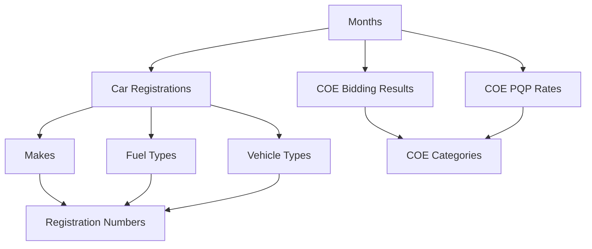

## Overview

The SG Cars Trends API provides access to structured data about Singapore's automotive market. This guide explains the core data models and their relationships.

## Core Data Models

### Car Registration Data

Car registration data represents monthly vehicle registration statistics by manufacturer, fuel type, and vehicle type.

```json
{
  "month": "2024-01",
  "make": "Toyota",
  "fuel_type": "Petrol",
  "vehicle_type": "Passenger Cars",
  "number": 245
}
```

#### Fields

| Field | Type | Description | Example |
|-------|------|-------------|---------|
| `month` | string | Registration month in YYYY-MM format | `"2024-01"` |
| `make` | string | Vehicle manufacturer/brand | `"Toyota"` |
| `fuel_type` | string | Type of fuel used | `"Petrol"` |
| `vehicle_type` | string | Category of vehicle | `"Passenger Cars"` |
| `number` | integer | Number of registrations | `245` |

#### Fuel Types

<CardGroup cols={2}>
  <Card title="Petrol">
    Traditional gasoline-powered vehicles
  </Card>
  <Card title="Diesel">
    Diesel-powered vehicles
  </Card>
  <Card title="Electric">
    Battery electric vehicles (BEV)
  </Card>
  <Card title="Hybrid">
    Petrol-electric hybrid vehicles
  </Card>
  <Card title="Others">
    Alternative fuel types (CNG, LPG, etc.)
  </Card>
</CardGroup>

#### Vehicle Types

<CardGroup cols={2}>
  <Card title="Passenger Cars">
    Standard passenger vehicles
  </Card>
  <Card title="Goods & Other Vehicles">
    Commercial and utility vehicles
  </Card>
  <Card title="Motorcycles & Scooters">
    Two-wheeled vehicles
  </Card>
  <Card title="Buses">
    Public and private buses
  </Card>
  <Card title="Taxis">
    Licensed taxi vehicles
  </Card>
  <Card title="Rental Cars">
    Car rental fleet vehicles
  </Card>
</CardGroup>

### COE Bidding Data

Certificate of Entitlement (COE) bidding data represents the results of Singapore's vehicle quota auction system.

```json
{
  "month": "2024-01",
  "bidding_no": 1,
  "vehicle_class": "Category A",
  "quota": 1000,
  "bids_success": 950,
  "bids_received": 1200,
  "premium": 85000
}
```

#### Fields

| Field | Type | Description | Example |
|-------|------|-------------|---------|
| `month` | string | Bidding month in YYYY-MM format | `"2024-01"` |
| `bidding_no` | integer | Bidding exercise number (1 or 2) | `1` |
| `vehicle_class` | string | COE category | `"Category A"` |
| `quota` | integer | Number of COEs available | `1000` |
| `bids_success` | integer | Number of successful bids | `950` |
| `bids_received` | integer | Total bids received | `1200` |
| `premium` | integer | Winning bid amount in SGD | `85000` |

#### COE Categories

<CardGroup cols={2}>
  <Card title="Category A">
    Cars with engine capacity ≤ 1600cc and maximum power ≤ 130 bhp
  </Card>
  <Card title="Category B">
    Cars with engine capacity > 1600cc or maximum power > 130 bhp
  </Card>
  <Card title="Category C">
    Goods vehicles and buses
  </Card>
  <Card title="Category D">
    Motorcycles
  </Card>
  <Card title="Category E">
    Open category (for all vehicles)
  </Card>
</CardGroup>

### COE PQP Data

Prevailing Quota Premium (PQP) data represents the benchmark COE prices used for vehicle valuation.

```json
{
  "month": "2024-01",
  "vehicle_class": "Category A",
  "pqp": 87500
}
```

#### Fields

| Field | Type | Description | Example |
|-------|------|-------------|---------|
| `month` | string | Month in YYYY-MM format | `"2024-01"` |
| `vehicle_class` | string | COE category | `"Category A"` |
| `pqp` | integer | PQP amount in SGD | `87500` |

### Months Data

Available data months for different data types.

```json
{
  "month": "2024-01",
  "has_cars": true,
  "has_coe": true
}
```

#### Fields

| Field | Type | Description | Example |
|-------|------|-------------|---------|
| `month` | string | Month in YYYY-MM format | `"2024-01"` |
| `has_cars` | boolean | Whether car data is available | `true` |
| `has_coe` | boolean | Whether COE data is available | `true` |

### Makes Data

Vehicle manufacturers/brands available in the dataset.

```json
{
  "make": "Toyota",
  "total_registrations": 2450,
  "months_active": 12
}
```

#### Fields

| Field | Type | Description | Example |
|-------|------|-------------|---------|
| `make` | string | Vehicle manufacturer/brand | `"Toyota"` |
| `total_registrations` | integer | Total registrations across all months | `2450` |
| `months_active` | integer | Number of months with data | `12` |

## Data Relationships

### Hierarchical Structure



### Data Aggregation

The API provides various aggregation levels:

1. **Individual Records**: Raw data points
2. **Monthly Summaries**: Aggregated by month
3. **Make Summaries**: Aggregated by manufacturer
4. **Fuel Type Summaries**: Aggregated by fuel type
5. **Vehicle Type Summaries**: Aggregated by vehicle type

## Data Quality and Updates

### Update Frequency

- **Car Registration Data**: Monthly (typically mid-month)
- **COE Bidding Data**: Bi-monthly (1st and 3rd Wednesday)
- **COE PQP Data**: Monthly (after COE bidding)

### Data Source

All data is sourced from Singapore's Land Transport Authority (LTA) DataMall, ensuring accuracy and official validation.

### Data Validation

<CardGroup cols={2}>
  <Card title="Checksum Verification">
    Files are validated using SHA-256 checksums
  </Card>
  <Card title="Schema Validation">
    All data passes through strict schema validation
  </Card>
  <Card title="Business Rules">
    Data consistency checks prevent anomalies
  </Card>
  <Card title="Historical Validation">
    Cross-referencing with historical data
  </Card>
</CardGroup>

## Usage Patterns

### Common Queries

1. **Monthly Trends**: Get all data for a specific month
2. **Make Comparison**: Compare registrations across manufacturers
3. **Fuel Type Analysis**: Track adoption of different fuel types
4. **COE Market Analysis**: Monitor COE premium trends
5. **Year-over-Year Growth**: Compare same months across years

### Performance Considerations

- **Indexing**: Data is indexed on month, make, and fuel_type
- **Caching**: Frequently accessed data is cached with Redis
- **Pagination**: Large datasets are paginated for optimal performance

## Next Steps

<CardGroup cols={2}>
  <Card
    title="Filtering Guide"
    icon="filter"
    href="/guides/filtering"
  >
    Learn advanced filtering techniques
  </Card>
  <Card
    title="Comparison Analytics"
    icon="chart-bar"
    href="/guides/comparison-analytics"
  >
    Use built-in comparison tools
  </Card>
  <Card
    title="API Reference"
    icon="book"
    href="/api-reference/overview"
  >
    Explore all endpoints
  </Card>
  <Card
    title="Examples"
    icon="code"
    href="/examples/javascript"
  >
    See practical examples
  </Card>
</CardGroup>