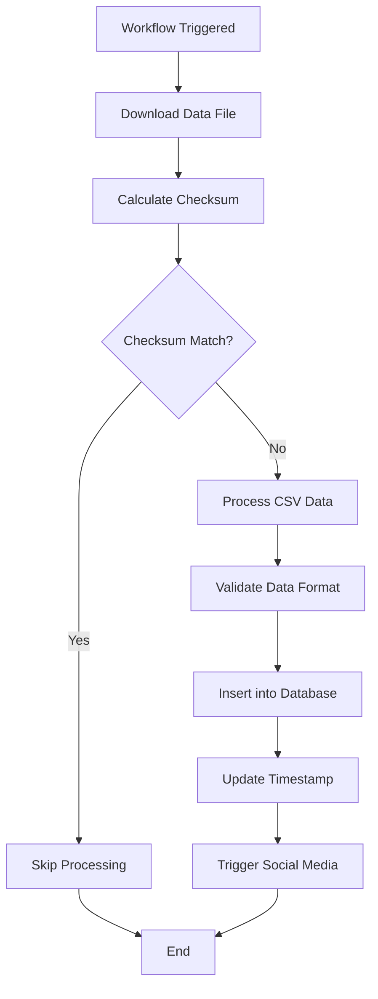

## Overview

The SG Cars Trends API includes a comprehensive workflow system for automated data updates and social media integration. This guide explains how workflows operate and how to interact with them.

## Workflow Architecture

### System Components

<CardGroup cols={2}>
  <Card
    title="Data Workflows"
    icon="database"
  >
    - Car registration data updates
    - COE bidding results updates
    - Automated file processing
    - Database synchronization
  </Card>
  <Card
    title="Social Media Integration"
    icon="share"
  >
    - LinkedIn posting
    - Twitter updates
    - Discord notifications
    - Telegram messages
  </Card>
</CardGroup>

### QStash Integration

The workflow system uses [QStash](https://upstash.com/docs/qstash) for reliable message queuing and scheduling:

- **Scheduled Jobs**: Automatic data updates via cron expressions
- **Retry Logic**: Automatic retries for failed operations
- **Dead Letter Queue**: Failed messages are preserved for analysis
- **Deduplication**: Prevents duplicate processing of the same data

## Data Update Workflows

### Car Registration Workflow

Updates car registration data from LTA DataMall:

<CodeGroup>

```bash curl
# Trigger car data update
curl -X POST "https://api.sgcarstrends.com/workflows/cars" \
  -H "Content-Type: application/json"
```

```javascript JavaScript
const response = await fetch('https://api.sgcarstrends.com/workflows/cars', {
  method: 'POST',
  headers: {
    'Content-Type': 'application/json',
  },
});

const result = await response.json();
console.log('Car workflow result:', result);
```

```python Python
import requests

response = requests.post(
    'https://api.sgcarstrends.com/workflows/cars',
    headers={'Content-Type': 'application/json'}
)

result = response.json()
print('Car workflow result:', result)
```

</CodeGroup>

### COE Bidding Workflow

Updates COE bidding results from official sources:

<CodeGroup>

```bash curl
# Trigger COE data update
curl -X POST "https://api.sgcarstrends.com/workflows/coe" \
  -H "Content-Type: application/json"
```

```javascript JavaScript
const response = await fetch('https://api.sgcarstrends.com/workflows/coe', {
  method: 'POST',
  headers: {
    'Content-Type': 'application/json',
  },
});

const result = await response.json();
console.log('COE workflow result:', result);
```

</CodeGroup>

### Workflow Trigger (Authenticated)

Trigger both car and COE workflows simultaneously:

<CodeGroup>

```bash curl
# Trigger all workflows (requires authentication)
curl -X POST "https://api.sgcarstrends.com/workflows/trigger" \
  -H "Authorization: Bearer YOUR_API_KEY" \
  -H "Content-Type: application/json"
```

```javascript JavaScript
const response = await fetch('https://api.sgcarstrends.com/workflows/trigger', {
  method: 'POST',
  headers: {
    'Authorization': 'Bearer YOUR_API_KEY',
    'Content-Type': 'application/json',
  },
});

const result = await response.json();
console.log('Workflow trigger result:', result);
```

</CodeGroup>

## Workflow Process

### 1. Data Download and Validation



### 2. Key Features

<CardGroup cols={2}>
  <Card
    title="Checksum Verification"
    icon="shield-check"
  >
    SHA-256 checksums prevent reprocessing identical files
  </Card>
  <Card
    title="Batch Processing"
    icon="database"
  >
    Efficient bulk database operations for large datasets
  </Card>
  <Card
    title="Error Handling"
    icon="exclamation-triangle"
  >
    Comprehensive error handling with Discord notifications
  </Card>
  <Card
    title="Conditional Publishing"
    icon="filter"
  >
    Social media posts only when new data is available
  </Card>
</CardGroup>

### 3. Data Processing Steps

1. **File Download**: Retrieve data from LTA DataMall
2. **Checksum Calculation**: Generate SHA-256 hash of downloaded file
3. **Duplicate Check**: Compare with stored checksums in Redis
4. **CSV Processing**: Parse CSV data with validation
5. **Database Insertion**: Bulk insert new records
6. **Timestamp Update**: Update last processed timestamp
7. **Social Media Trigger**: Publish updates if new data exists

## Social Media Integration

### LinkedIn Integration

Post updates to LinkedIn company pages:

<CodeGroup>

```bash curl
curl -X POST "https://api.sgcarstrends.com/workflows/linkedin/post" \
  -H "Content-Type: application/json" \
  -d '{
    "message": "New car registration data available for January 2024",
    "link": "https://sgcarstrends.com/cars/2024-01"
  }'
```

```javascript JavaScript
const response = await fetch('https://api.sgcarstrends.com/workflows/linkedin/post', {
  method: 'POST',
  headers: {
    'Content-Type': 'application/json',
  },
  body: JSON.stringify({
    message: 'New car registration data available for January 2024',
    link: 'https://sgcarstrends.com/cars/2024-01'
  }),
});

const result = await response.json();
```

</CodeGroup>

### Twitter Integration

Post updates to Twitter:

<CodeGroup>

```bash curl
curl -X POST "https://api.sgcarstrends.com/workflows/twitter/post" \
  -H "Content-Type: application/json" \
  -d '{
    "message": "📊 January 2024 car registration data is now available! Check out the latest trends in Singapore'"'"'s automotive market.",
    "link": "https://sgcarstrends.com/cars/2024-01"
  }'
```

```javascript JavaScript
const response = await fetch('https://api.sgcarstrends.com/workflows/twitter/post', {
  method: 'POST',
  headers: {
    'Content-Type': 'application/json',
  },
  body: JSON.stringify({
    message: '📊 January 2024 car registration data is now available! Check out the latest trends in Singapore\'s automotive market.',
    link: 'https://sgcarstrends.com/cars/2024-01'
  }),
});
```

</CodeGroup>

### Discord Integration

Send notifications to Discord channels:

<CodeGroup>

```bash curl
curl -X POST "https://api.sgcarstrends.com/workflows/discord/post" \
  -H "Content-Type: application/json" \
  -d '{
    "message": "🚗 **New Data Available**\n\nJanuary 2024 car registration data has been updated!\n\n🔗 View details: https://sgcarstrends.com/cars/2024-01"
  }'
```

```javascript JavaScript
const response = await fetch('https://api.sgcarstrends.com/workflows/discord/post', {
  method: 'POST',
  headers: {
    'Content-Type': 'application/json',
  },
  body: JSON.stringify({
    message: '🚗 **New Data Available**\n\nJanuary 2024 car registration data has been updated!\n\n🔗 View details: https://sgcarstrends.com/cars/2024-01'
  }),
});
```

</CodeGroup>

### Telegram Integration

Send messages to Telegram channels:

<CodeGroup>

```bash curl
curl -X POST "https://api.sgcarstrends.com/workflows/telegram/post" \
  -H "Content-Type: application/json" \
  -d '{
    "message": "📈 New car registration data for January 2024 is available! Electric vehicle registrations continue to grow.",
    "link": "https://sgcarstrends.com/cars/2024-01"
  }'
```

```javascript JavaScript
const response = await fetch('https://api.sgcarstrends.com/workflows/telegram/post', {
  method: 'POST',
  headers: {
    'Content-Type': 'application/json',
  },
  body: JSON.stringify({
    message: '📈 New car registration data for January 2024 is available! Electric vehicle registrations continue to grow.',
    link: 'https://sgcarstrends.com/cars/2024-01'
  }),
});
```

</CodeGroup>

## Scheduled Operations

### Cron Schedule

Workflows run on the following schedule:

| Workflow | Schedule | Description |
|----------|----------|-------------|
| Car Data Update | `0 0 15 * *` | 15th of each month at midnight |
| COE Data Update | `0 0 * * 3` | Every Wednesday at midnight |
| Health Check | `0 */6 * * *` | Every 6 hours |

### Manual Triggers

You can manually trigger workflows for testing or immediate updates:

<CodeGroup>

```javascript JavaScript
// Function to trigger workflow and monitor result
async function triggerWorkflow(workflowType) {
  const endpoint = `https://api.sgcarstrends.com/workflows/${workflowType}`;
  
  try {
    const response = await fetch(endpoint, {
      method: 'POST',
      headers: {
        'Content-Type': 'application/json',
      },
    });
    
    if (!response.ok) {
      throw new Error(`HTTP error! status: ${response.status}`);
    }
    
    const result = await response.json();
    console.log(`${workflowType} workflow result:`, result);
    
    return result;
  } catch (error) {
    console.error(`Failed to trigger ${workflowType} workflow:`, error);
    throw error;
  }
}

// Usage
await triggerWorkflow('cars');
await triggerWorkflow('coe');
```

</CodeGroup>

## Error Handling and Monitoring

### Error Scenarios

<CardGroup cols={2}>
  <Card
    title="Download Failures"
    icon="download"
  >
    - Network timeouts
    - Invalid file formats
    - Corrupted downloads
  </Card>
  <Card
    title="Processing Failures"
    icon="exclamation-triangle"
  >
    - CSV parsing errors
    - Database connection issues
    - Validation failures
  </Card>
  <Card
    title="Social Media Failures"
    icon="share"
  >
    - API rate limits
    - Authentication errors
    - Content policy violations
  </Card>
  <Card
    title="Infrastructure Failures"
    icon="server"
  >
    - Redis connection issues
    - QStash delivery failures
    - AWS service outages
  </Card>
</CardGroup>

### Monitoring and Alerts

1. **Discord Notifications**: Critical errors are sent to Discord
2. **QStash Dead Letter Queue**: Failed messages are preserved
3. **Health Check Endpoint**: Monitor system status
4. **Workflow Logs**: Detailed logging for troubleshooting

### Health Check

Monitor workflow system health:

<CodeGroup>

```bash curl
curl "https://api.sgcarstrends.com/health" \
  -H "Content-Type: application/json"
```

```javascript JavaScript
const response = await fetch('https://api.sgcarstrends.com/health');
const health = await response.json();

console.log('System health:', health);
```

</CodeGroup>

### Response Format

```json
{
  "success": true,
  "data": {
    "status": "healthy",
    "timestamp": "2024-01-15T10:30:00Z",
    "services": {
      "database": "connected",
      "redis": "connected",
      "qstash": "operational"
    },
    "last_update": {
      "cars": "2024-01-15T02:00:00Z",
      "coe": "2024-01-10T02:00:00Z"
    }
  }
}
```

## Best Practices

### 1. Workflow Timing

<Warning>
  Be mindful of workflow timing to avoid conflicts with scheduled operations.
</Warning>

- **Avoid Peak Hours**: Don't trigger manual workflows during scheduled times
- **Rate Limiting**: Respect API rate limits for external services
- **Database Load**: Consider database performance during bulk operations

### 2. Error Recovery

<CodeGroup>

```javascript JavaScript
async function robustWorkflowTrigger(workflowType, maxRetries = 3) {
  for (let attempt = 1; attempt <= maxRetries; attempt++) {
    try {
      const result = await triggerWorkflow(workflowType);
      return result;
    } catch (error) {
      console.log(`Attempt ${attempt} failed:`, error.message);
      
      if (attempt === maxRetries) {
        throw new Error(`Failed after ${maxRetries} attempts: ${error.message}`);
      }
      
      // Exponential backoff
      await new Promise(resolve => setTimeout(resolve, 1000 * Math.pow(2, attempt)));
    }
  }
}
```

</CodeGroup>

### 3. Data Validation

Always validate workflow responses:

<CodeGroup>

```javascript JavaScript
function validateWorkflowResponse(response) {
  if (!response.success) {
    throw new Error(`Workflow failed: ${response.error}`);
  }
  
  if (!response.data) {
    throw new Error('No data returned from workflow');
  }
  
  return true;
}
```

</CodeGroup>

## Development and Testing

### Local Development

For local development and testing:

1. **Environment Variables**: Set up required environment variables
2. **Mock Data**: Use mock data for testing workflows
3. **Dry Run Mode**: Test workflows without actual data updates
4. **Staging Environment**: Test in staging before production

### Testing Workflows

<CodeGroup>

```javascript JavaScript
// Test workflow without side effects
async function testWorkflow(workflowType) {
  const testEndpoint = `https://api-staging.sgcarstrends.com/workflows/${workflowType}`;
  
  const response = await fetch(testEndpoint, {
    method: 'POST',
    headers: {
      'Content-Type': 'application/json',
      'X-Test-Mode': 'true' // Custom header for test mode
    },
  });
  
  return await response.json();
}
```

</CodeGroup>

## Integration Examples

### Custom Workflow Integration

<CodeGroup>

```javascript JavaScript
// Custom workflow that combines multiple operations
async function customDataUpdateWorkflow() {
  try {
    console.log('Starting custom data update workflow...');
    
    // Step 1: Trigger car data update
    const carResult = await triggerWorkflow('cars');
    console.log('Car data update completed:', carResult.success);
    
    // Step 2: Trigger COE data update
    const coeResult = await triggerWorkflow('coe');
    console.log('COE data update completed:', coeResult.success);
    
    // Step 3: Post to social media if new data was processed
    if (carResult.data?.processed_new_data || coeResult.data?.processed_new_data) {
      await postToSocialMedia('New data available for January 2024!');
    }
    
    console.log('Custom workflow completed successfully');
    
  } catch (error) {
    console.error('Custom workflow failed:', error);
    
    // Send alert to Discord
    await fetch('https://api.sgcarstrends.com/workflows/discord/post', {
      method: 'POST',
      headers: { 'Content-Type': 'application/json' },
      body: JSON.stringify({
        message: `⚠️ Custom workflow failed: ${error.message}`
      })
    });
  }
}

async function postToSocialMedia(message) {
  const platforms = ['linkedin', 'twitter', 'discord', 'telegram'];
  
  const results = await Promise.allSettled(
    platforms.map(platform => 
      fetch(`https://api.sgcarstrends.com/workflows/${platform}/post`, {
        method: 'POST',
        headers: { 'Content-Type': 'application/json' },
        body: JSON.stringify({ message })
      })
    )
  );
  
  results.forEach((result, index) => {
    if (result.status === 'fulfilled') {
      console.log(`${platforms[index]} post successful`);
    } else {
      console.error(`${platforms[index]} post failed:`, result.reason);
    }
  });
}
```

</CodeGroup>

## Next Steps

<CardGroup cols={2}>
  <Card
    title="Development Setup"
    icon="code"
    href="/development/setup"
  >
    Set up local development environment
  </Card>
  <Card
    title="API Reference"
    icon="book"
    href="/api-reference/workflows/trigger-workflows"
  >
    Explore workflow API endpoints
  </Card>
  <Card
    title="Examples"
    icon="lightbulb"
    href="/examples/javascript"
  >
    See workflow integration examples
  </Card>
  <Card
    title="Monitoring"
    icon="chart-line"
    href="/development/testing"
  >
    Learn about monitoring and testing
  </Card>
</CardGroup>