# Infrastructure Architecture

This document describes the Vercel-based infrastructure setup for the SG Cars Trends platform.

## Infrastructure Diagram

```mermaid
graph TB
    %% Users and External Access
    Users[End Users]
    Developers[Developers]

    %% DNS Layer
    subgraph "DNS Management"
        VercelDNS[Vercel DNS]

        subgraph "Domain Strategy"
            ProdDomain[sgcarstrends.com]
            PreviewDomain[*.vercel.app]
        end
    end

    %% Vercel Infrastructure
    subgraph "Vercel Platform"
        %% Edge Network
        subgraph "Edge Network"
            EdgeFunctions[Edge Functions]
            CDN[Global CDN]
        end

        %% Web Application
        subgraph "Web Application"
            NextjsSSR[Next.js Server Functions]
            StaticAssets[Static Assets]

            subgraph "Function Config"
                Runtime[Node.js 22.x]
                Region[Singapore Region]
                NextjsFramework[Next.js 16 Framework]
            end
        end

        %% Workflows
        subgraph "Vercel WDK Workflows"
            CarsWorkflow[Cars Data Workflow]
            COEWorkflow[COE Data Workflow]
            DeregWorkflow[Deregistrations Workflow]
            VercelCron[Vercel Cron Scheduler]
        end
    end

    %% External Services
    subgraph "External Services"
        %% Data Sources
        subgraph "Data Sources"
            LTA[LTA DataMall APIs]
            GeminiAI[Vercel AI SDK + Google Gemini]
        end

        %% Databases
        subgraph "Managed Databases"
            PostgreSQL[(PostgreSQL Database<br/>Neon)]
            Upstash[(Redis Cache<br/>Upstash)]
            Blob[(Vercel Blob<br/>Logo Storage)]
        end

        %% Social Media
        subgraph "Social Media APIs"
            Discord[Discord Webhooks]
            LinkedIn[LinkedIn API]
            Telegram[Telegram Bot API]
            Twitter[Twitter API]
        end
    end

    %% Traffic Flow
    Users --> VercelDNS
    Developers --> VercelDNS

    %% DNS Resolution
    VercelDNS --> ProdDomain
    VercelDNS --> PreviewDomain

    %% CDN Distribution
    ProdDomain --> CDN
    PreviewDomain --> CDN

    %% Web Traffic
    CDN --> EdgeFunctions
    CDN --> NextjsSSR
    CDN --> StaticAssets

    %% Function Configuration
    NextjsSSR --> Runtime
    NextjsSSR --> Region
    NextjsSSR --> NextjsFramework

    %% Workflow Triggers
    VercelCron --> CarsWorkflow
    VercelCron --> COEWorkflow
    VercelCron --> DeregWorkflow

    %% External Connections
    CarsWorkflow --> LTA
    COEWorkflow --> LTA
    DeregWorkflow --> LTA
    CarsWorkflow --> GeminiAI
    COEWorkflow --> GeminiAI

    NextjsSSR --> PostgreSQL
    NextjsSSR --> Upstash
    NextjsSSR --> Blob

    CarsWorkflow --> PostgreSQL
    COEWorkflow --> PostgreSQL
    DeregWorkflow --> PostgreSQL

    CarsWorkflow --> Discord
    CarsWorkflow --> LinkedIn
    CarsWorkflow --> Telegram
    CarsWorkflow --> Twitter

    %% Styling
    classDef vercel fill:#000,color:#fff
    classDef external fill:#e0e0e0
    classDef dns fill:#f76707
    classDef function fill:#7c4dff,color:#fff
    classDef database fill:#4caf50,color:#fff
    classDef social fill:#2196f3,color:#fff

    class EdgeFunctions,CDN,NextjsSSR,StaticAssets,CarsWorkflow,COEWorkflow,DeregWorkflow,VercelCron vercel
    class VercelDNS dns
    class Runtime,Region,NextjsFramework function
    class PostgreSQL,Upstash,Blob database
    class LTA,GeminiAI external
    class Discord,LinkedIn,Telegram,Twitter social
```

## Infrastructure Overview

### Technology Stack

**Platform**: Vercel
- Automatic deployments from Git
- Global edge network
- Serverless functions
- Built-in CI/CD

**DNS**: Vercel DNS
- Automatic SSL/TLS certificates
- Global DNS resolution
- Custom domain support

### Deployment Strategy

**Production**
- Domain: `sgcarstrends.com`
- Trigger: Push to `main` branch
- Automatic deployments

**Preview**
- Domain: `*.vercel.app` (auto-generated)
- Trigger: Pull requests
- Automatic preview URLs for each PR

### Environment Variables

Environment variables are managed in the Vercel dashboard:

**Core**
- `DATABASE_URL`: Neon PostgreSQL connection
- `UPSTASH_REDIS_REST_URL`, `UPSTASH_REDIS_REST_TOKEN`: Redis cache

**Storage**
- `BLOB_READ_WRITE_TOKEN`: Vercel Blob for logo storage

**AI Integration**
- `GOOGLE_GENERATIVE_AI_API_KEY`: Google Gemini for blog generation

**Social Media**
- Discord, LinkedIn, Telegram, Twitter credentials

## External Service Integration

### Data Sources

**LTA DataMall APIs**
- Vehicle registration data
- COE bidding results
- Daily updates via Vercel Cron

**Vercel AI SDK + Google Gemini**
- Automated blog post generation
- Market analysis content

### Databases

**PostgreSQL (Neon)**
- Serverless PostgreSQL
- Auto-scaling
- Branch-based development databases

**Redis (Upstash)**
- Serverless Redis
- API response caching
- Rate limiting

**Vercel Blob**
- Car logo storage
- Global CDN delivery

### Workflow Orchestration

**Vercel WDK (Workflow Development Kit)**
- Durable workflow execution
- Automatic retries
- Step-based orchestration

**Vercel Cron**
- Scheduled workflow triggers
- Daily data updates (10:00 AM SGT)

## Monitoring

**Vercel Dashboard**
- Deployment logs
- Function logs
- Analytics and metrics

**Error Tracking**
- Function error logging
- Workflow failure notifications via Discord

## Related Documentation

- [System Architecture Overview](./system.md)
- [Data Processing Workflows](./workflows.md)
