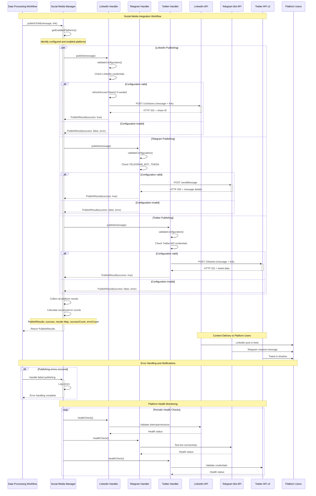

# Social Media Integration

This document describes the comprehensive social media integration system that automatically distributes updates across multiple platforms when new data is processed or blog posts are published.

## Social Media Integration Sequence Diagram



## Architecture Overview

### Social Media Manager

The `SocialMediaManager` class serves as the central orchestrator for all social media integrations, providing:

**Unified Interface**: Single point of entry for publishing across all platforms
**Parallel Execution**: Simultaneous posting to all configured platforms
**Error Handling**: Graceful degradation when individual platforms fail
**Result Aggregation**: Comprehensive reporting of success/failure statistics

### Platform Handler Interface

Each social media platform implements the `PlatformHandler` interface, ensuring consistency and interoperability:

```typescript
interface PlatformHandler {
  readonly platform: Platform;
  readonly config: PlatformConfig;
  
  publish(message: SocialMessage): Promise<PublishResult>;
  healthCheck(): Promise<PlatformHealth>;
  validateConfiguration(): boolean;
}
```

## Platform Integrations

### LinkedIn Integration

**Purpose**: Professional business updates and market insights
**Integration Type**: LinkedIn API with OAuth 2.0

**Configuration**:
- `LINKEDIN_CLIENT_ID`: Application client identifier
- `LINKEDIN_CLIENT_SECRET`: Application secret
- `LINKEDIN_ACCESS_TOKEN`: User access token
- `LINKEDIN_REFRESH_TOKEN`: Token refresh capability
- `LINKEDIN_ORGANISATION_ID`: Target organisation page
- `LINKEDIN_USER_ID`: Authenticated user identifier

**Features**:
- **Professional Content**: Business-focused content formatting
- **Token Management**: Automatic access token refresh
- **Organisation Posting**: Post to company pages
- **Rich Media**: Support for links and formatted text

**OAuth Flow**:
1. **Initial Authentication**: Manual OAuth flow to obtain tokens
2. **Token Storage**: Secure storage of access and refresh tokens
3. **Automatic Refresh**: Token refresh before expiration
4. **Error Recovery**: Re-authentication flow for invalid tokens

**Message Format**:
```typescript
{
  content: {
    contentEntities: [{
      entityLocation: "https://sgcarstrends.com/blog/january-2024-market-analysis",
      thumbnails: [{
        resolvedUrl: "https://sgcarstrends.com/og-image.png"
      }]
    }],
    title: "📰 New Blog Post: January 2024 Vehicle Market Analysis"
  },
  distribution: {
    feedDistribution: "MAIN_FEED",
    targetEntities: [],
    thirdPartyDistributionChannels: []
  }
}
```

### Telegram Integration

**Purpose**: Channel-based broadcasting to subscribers
**Integration Type**: Telegram Bot API

**Configuration**:
- `TELEGRAM_BOT_TOKEN`: Bot authentication token
- `TELEGRAM_CHANNEL_ID`: Target channel identifier

**Features**:
- **Channel Broadcasting**: Direct posting to Telegram channels
- **Markdown Support**: Rich text formatting with Telegram markdown
- **Instant Delivery**: Real-time message delivery to subscribers
- **Bot Management**: Administrative capabilities through bot interface

**Bot Setup Process**:
1. **Create Bot**: Use @BotFather to create new bot
2. **Obtain Token**: Receive bot token from BotFather
3. **Channel Setup**: Add bot as administrator to target channel
4. **Get Channel ID**: Use bot API to identify channel ID

**Message Format**:
```typescript
{
  chat_id: "@sgcarstrends",
  text: `🚗 *Updated car registration data for January 2024!*

📊 Total registrations: 12,345
⚡ *By Fuel Type:*
• Petrol: 8,000
• Electric: 2,000
• Hybrid: 2,345

[View Details](https://sgcarstrends.com/cars?month=2024-01)`,
  parse_mode: "Markdown",
  disable_web_page_preview: false
}
```

### Twitter Integration

**Purpose**: Social media engagement and public updates
**Integration Type**: Twitter API v2 with OAuth 1.0a

**Configuration**:
- `TWITTER_APP_KEY`: Application API key
- `TWITTER_APP_SECRET`: Application secret
- `TWITTER_ACCESS_TOKEN`: User access token
- `TWITTER_ACCESS_SECRET`: User access token secret

**Features**:
- **Tweet Publishing**: Direct posting to Twitter timeline
- **Character Optimization**: Automatic message truncation for 280-character limit
- **Link Handling**: Automatic URL shortening with t.co
- **Engagement Tracking**: Tweet performance metrics

**Authentication**:
- **OAuth 1.0a**: Twitter's authentication protocol
- **Application Credentials**: API key and secret for app identification
- **User Tokens**: Access token and secret for user authorization
- **Signature Generation**: Automatic request signing

**Message Format**:
```typescript
{
  text: `🚗 Updated car registration data for Jan 2024!
📊 Total: 12,345
⚡ Electric: 2,000 (+15%)
🔗 https://sgcarstrends.com/cars?month=2024-01 #SgCars #ElectricVehicles`
}
```

## Publishing Workflow

### Message Structure

All social media messages follow a consistent structure:

```typescript
interface SocialMessage {
  message: string;  // Main content
  link: string;     // Associated URL
}
```

### Publishing Process

1. **Trigger**: Data processing workflow completes successfully
2. **Message Creation**: Generate platform-agnostic message and link
3. **Manager Invocation**: Call `SocialMediaManager.publishToAll()`
4. **Platform Detection**: Identify enabled platforms with valid configuration
5. **Parallel Execution**: Simultaneously post to all valid platforms
6. **Result Aggregation**: Collect success/failure results from all platforms
7. **Error Handling**: Log failures for monitoring
8. **Response**: Return comprehensive results to calling workflow

### Content Formatting

Each platform handler applies platform-specific formatting:

**LinkedIn**: Professional tone with structured content
**Telegram**: Telegram markdown with clickable links
**Twitter**: Hashtag optimization and character limit compliance

### Error Handling

**Graceful Degradation**: Failed platforms don't prevent successful publishing to others
**Error Logging**: Failed platform attempts are logged for monitoring
**Retry Logic**: Configurable retry mechanisms for transient failures
**Health Monitoring**: Regular platform connectivity checks

## Configuration Management

### Environment-Based Configuration

**Development**: Disabled or test webhooks
**Staging**: Test channels/accounts for validation
**Production**: Live channels and official accounts

### Platform Enablement

Platforms are enabled based on configuration availability:

```typescript
interface PlatformConfig {
  enabled: boolean;
  requiredEnvVars: string[];
  validateConfig?(): boolean;
}
```

**Configuration Validation**:
- Check for required environment variables
- Validate token/credential format
- Test connectivity during startup
- Graceful handling of missing configuration

### Security Considerations

**Token Security**: All credentials stored as environment variables
**Webhook Validation**: Discord webhook signatures verified where available
**Rate Limiting**: Respect platform-specific API limits
**Scoped Permissions**: Minimal required permissions for each platform

## Monitoring and Analytics

### Publishing Metrics

**Success Rates**: Track publishing success per platform
**Error Frequencies**: Identify problematic platforms or configurations
**Response Times**: Monitor platform API performance
**Content Engagement**: Track clicks and interactions (where available)

### Health Monitoring

**Connectivity Checks**: Regular validation of platform accessibility
**Token Expiration**: Proactive monitoring of authentication status
**Rate Limit Tracking**: Monitor API quota usage
**Error Pattern Analysis**: Identify recurring issues

### Alerting

**CloudWatch Alarms**: AWS-native monitoring for critical failures
**Structured Logging**: Error details logged for analysis
**Dashboard Integration**: Visual monitoring of social media health

## Content Strategy

### Content Types

**Data Updates**: Raw data announcements with key metrics
**Blog Announcements**: New blog post promotions with excerpts
**Market Insights**: Key findings and trend observations
**System Status**: Maintenance and system update notifications

### Platform-Specific Adaptation

**LinkedIn**: Professional insights with business implications
**Telegram**: Concise updates with relevant links
**Twitter**: Engaging content with trending hashtags

### Timing and Frequency

**Data Updates**: Immediate posting when new data is processed
**Blog Posts**: Scheduled posting aligned with blog publication
**Rate Limiting**: Respect platform guidelines for posting frequency
**Audience Optimization**: Time posts for maximum engagement

## Future Enhancements

### Potential Integrations

**Instagram**: Visual content sharing for infographics
**Facebook**: Business page updates and community engagement
**YouTube**: Video content for data visualizations
**Reddit**: Community discussions and AMA sessions

### Advanced Features

**Content Personalization**: Platform-specific content optimization
**A/B Testing**: Message variant testing for engagement optimization
**Analytics Integration**: Comprehensive cross-platform analytics
**Automated Scheduling**: Optimal timing based on audience insights

### Technical Improvements

**Queue System**: Message queue for reliable delivery
**Retry Mechanisms**: Advanced retry logic with exponential backoff
**Circuit Breakers**: Temporary platform disabling for persistent failures
**Multi-Account Support**: Support for multiple accounts per platform

## Related Documentation

- [System Architecture Overview](./system)
- [Data Processing Workflows](./workflows)
- [Web Application Documentation](../../apps/web/CLAUDE.md)