# System Architecture Overview

This document provides a high-level overview of the SG Cars Trends platform architecture, illustrating how the various components interact to deliver Singapore vehicle registration data and COE bidding results.

## Architecture Diagram

```mermaid
graph TB
    %% External Services
    LTA[LTA DataMall APIs]

    %% AI Services
    Gemini[Vercel AI SDK + Google Gemini]

    %% Social Media Platforms
    Discord[Discord]
    LinkedIn[LinkedIn]
    Telegram[Telegram]
    Twitter[Twitter]

    %% Infrastructure Layer
    subgraph "Vercel Platform"
        subgraph "Compute"
            WebFunctions[Next.js Server Functions]
            WDKRuntime[WDK Workflow Runtime]
        end

        subgraph "Edge Network"
            VercelEdge[Vercel Edge Network]
            VercelCDN[Vercel CDN]
        end

        subgraph "Cron Jobs"
            CronScheduler[Vercel Cron]
        end
    end

    %% External Storage
    subgraph "Managed Services"
        Neon[(Neon PostgreSQL)]
        Upstash[(Upstash Redis)]
        Blob[Vercel Blob Storage]
    end

    %% Application Layer
    subgraph "SG Cars Trends Platform"
        subgraph "Apps"
            Web[Web Application - Next.js 16]
        end

        subgraph "Packages"
            Database[Database Package - Drizzle ORM]
            Types[Types Package]
            Utils[Utils Package + Redis Client]
            AI[AI Package - Blog Generation]
            Logos[Logos Package - Vercel Blob]
        end
    end

    %% Workflow System
    subgraph "Data Processing"
        CarsWorkflow[Cars Data Workflow]
        COEWorkflow[COE Data Workflow]
        DeregWorkflow[Deregistrations Workflow]
        BlogWorkflow[Blog Generation Workflow]
    end

    %% Connections
    %% User to Infrastructure
    Users[Users] --> VercelEdge
    VercelEdge --> VercelCDN
    VercelCDN --> WebFunctions

    %% Application to Infrastructure
    Web --> WebFunctions

    %% Package dependencies
    Web --> Database
    Web --> Types
    Web --> Utils
    Web --> AI
    Web --> Logos

    %% Database connections
    Database --> Neon
    Utils --> Upstash
    Web --> Neon
    Web --> Upstash
    Logos --> Blob
    Logos --> Upstash

    %% Workflow connections
    CronScheduler --> WDKRuntime
    WDKRuntime --> CarsWorkflow
    WDKRuntime --> COEWorkflow
    WDKRuntime --> DeregWorkflow
    WDKRuntime --> BlogWorkflow

    %% External API connections
    CarsWorkflow --> LTA
    COEWorkflow --> LTA
    DeregWorkflow --> LTA
    BlogWorkflow --> Gemini

    %% Social media connections
    CarsWorkflow --> Discord
    CarsWorkflow --> LinkedIn
    CarsWorkflow --> Telegram
    CarsWorkflow --> Twitter
    COEWorkflow --> Discord
    COEWorkflow --> LinkedIn
    COEWorkflow --> Telegram
    COEWorkflow --> Twitter

    %% Styling
    classDef app fill:#e1f5fe
    classDef package fill:#f3e5f5
    classDef infrastructure fill:#e8f5e8
    classDef external fill:#fff3e0
    classDef workflow fill:#fce4ec
    classDef storage fill:#e0f2f1

    class Web app
    class Database,Types,Utils,AI,Logos package
    class WebFunctions,WDKRuntime,VercelEdge,VercelCDN,CronScheduler infrastructure
    class LTA,Gemini,Discord,LinkedIn,Telegram,Twitter external
    class CarsWorkflow,COEWorkflow,DeregWorkflow,BlogWorkflow workflow
    class Neon,Upstash,Blob storage
```

## System Components

### Applications Layer

**Web Application (Next.js 16)**
- User-facing interface with interactive charts and analytics
- Blog functionality with LLM-generated content
- Integrated workflow API endpoints (`/api/workflows/*`)
- Server Components with `"use cache"` for optimal performance
- Real-time analytics tracking with Vercel Analytics

### Shared Packages

**Database Package**
- Drizzle ORM schema definitions
- Type-safe database queries
- Migration management
- Shared database client configuration

**AI Package**
- Vercel AI SDK with Google Gemini integration
- 2-step blog generation (analysis → structured output)
- Zod schemas for structured responses
- Langfuse telemetry for LLM observability

**Logos Package**
- Car brand logo management
- Vercel Blob storage integration
- Redis caching for performance
- Brand name normalization

**Types Package**
- Shared TypeScript interfaces
- API request/response types
- Domain model definitions

**Utils Package**
- Common utility functions
- Redis client configuration (Upstash)
- Date formatting and calculations

### Infrastructure Layer

**Vercel Platform (Singapore Region - sin1)**
- **Server Functions**: Next.js App Router with Server Components
- **Edge Network**: Global CDN with edge caching
- **Cron Jobs**: Scheduled workflow triggers
- **WDK Runtime**: Durable workflow execution

**Managed Services**
- **Neon PostgreSQL**: Serverless PostgreSQL database
- **Upstash Redis**: Serverless Redis for caching
- **Vercel Blob**: Object storage for car logos

### Data Processing Workflows

**WDK Orchestration**
- Scheduled via Vercel Cron (daily at 10 AM UTC / 6 PM SGT)
- Durable workflow state with automatic retries
- Error handling with RetryableError and FatalError

**Cars Data Workflow**
- LTA DataMall integration for vehicle registration data
- CSV processing and data transformation
- Database updates with duplicate detection
- Blog generation and social media distribution

**COE Data Workflow**
- COE bidding results processing
- Prevailing Quota Premium (PQP) data handling
- Conditional blog generation when bidding cycles complete

**Deregistrations Workflow**
- Vehicle deregistration data processing
- Monthly statistics aggregation

**Blog Generation Workflow**
- Vercel AI SDK with Google Gemini for content creation
- Market analysis and insights generation
- SEO optimization and metadata creation

### External Integrations

**Data Sources**
- **LTA DataMall**: Official Singapore vehicle and COE data
- **Vercel AI SDK + Google Gemini**: LLM for automated blog content generation

**Social Media Platforms**
- **Discord**: Webhook-based notifications
- **LinkedIn**: API-based business updates
- **Telegram**: Bot-based channel messaging
- **Twitter**: API-based social media posts

## Data Flow

1. **Data Ingestion**: Cron-triggered workflows fetch data from LTA DataMall
2. **Data Processing**: CSV files are parsed, validated, and transformed
3. **Data Storage**: Processed data is stored in Neon PostgreSQL with Redis caching
4. **Content Generation**: AI generates blog posts from processed data
5. **Distribution**: Updates are published to social media platforms
6. **User Access**: Web application serves data via Vercel Edge Network

## Key Architectural Decisions

**Monorepo Structure**
- Centralized codebase with shared packages
- Consistent tooling and development experience
- Type safety across application boundaries

**Vercel Platform**
- Zero-config deployments from GitHub
- Automatic preview deployments for PRs
- Global edge network for low latency
- Integrated cron and workflow runtime

**Workflow-Based Processing**
- Reliable data processing with error recovery
- Atomic operations with state management
- Scheduled execution with manual override capability

**Multi-Platform Social Integration**
- Diversified content distribution
- Platform-specific content formatting
- Graceful degradation with error notifications

## Related Documentation

- [Data Processing Workflows](./workflows)
- [Database Schema](./database)
- [Infrastructure Setup](./infrastructure)
- [Social Media Integration](./social)
