# System Architecture Overview

This document provides a high-level overview of the SG Cars Trends platform architecture, illustrating how the various components interact to deliver Singapore vehicle registration data and COE bidding results.

## Architecture Diagram

```mermaid
graph TB
    %% External Services
    LTA[LTA DataMall APIs]
    Cloudflare[Cloudflare DNS]
    
    %% AI Services
    Gemini[Vercel AI SDK + Google Gemini]
    
    %% Social Media Platforms
    Discord[Discord]
    LinkedIn[LinkedIn]
    Telegram[Telegram]
    Twitter[Twitter]
    
    %% Infrastructure Layer
    subgraph "AWS Infrastructure"
        subgraph "Compute"
            APILambda[API Lambda Functions]
            WebLambda[Web Lambda Functions]
        end
        
        subgraph "Storage"
            RDS[(PostgreSQL Database)]
            Redis[(Redis Cache - Upstash)]
        end
        
        subgraph "Networking"
            CloudFront[CloudFront CDN]
            APIGateway[API Gateway]
        end
    end
    
    %% Application Layer
    subgraph "SG Cars Trends Platform"
        subgraph "Apps"
            API[API Service - Hono]
            Web[Web Application - Next.js]
            Docs[Documentation - Mintlify]
        end
        
        subgraph "Packages"
            Database[Database Package - Drizzle ORM]
            Types[Types Package]
            Utils[Utils Package + Redis Client]
        end
    end
    
    %% Workflow System
    subgraph "Data Processing"
        QStash[QStash Workflows]
        CarsWorkflow[Cars Data Workflow]
        COEWorkflow[COE Data Workflow]
        BlogWorkflow[Blog Generation Workflow]
        SocialWorkflow[Social Media Workflow]
    end
    
    %% Connections
    %% External to Infrastructure
    Cloudflare --> CloudFront
    
    %% Infrastructure connections
    CloudFront --> APIGateway
    CloudFront --> WebLambda
    APIGateway --> APILambda
    
    %% Application to Infrastructure
    API --> APILambda
    Web --> WebLambda
    
    %% Package dependencies
    API --> Database
    API --> Types
    API --> Utils
    Web --> Types
    Web --> Utils
    
    %% Database connections
    Database --> RDS
    Utils --> Redis
    API --> RDS
    API --> Redis
    Web --> Redis
    
    %% Workflow connections
    API --> QStash
    QStash --> CarsWorkflow
    QStash --> COEWorkflow
    QStash --> BlogWorkflow
    QStash --> SocialWorkflow
    
    %% External API connections
    CarsWorkflow --> LTA
    COEWorkflow --> LTA
    BlogWorkflow --> Gemini
    
    %% Social media connections
    SocialWorkflow --> Discord
    SocialWorkflow --> LinkedIn
    SocialWorkflow --> Telegram
    SocialWorkflow --> Twitter
    
    %% User interactions
    Users[Users] --> CloudFront
    Developers[Developers] --> Docs
    
    %% Styling
    classDef app fill:#e1f5fe
    classDef package fill:#f3e5f5
    classDef infrastructure fill:#e8f5e8
    classDef external fill:#fff3e0
    classDef workflow fill:#fce4ec
    
    class API,Web,Docs app
    class Database,Types,Utils package
    class APILambda,WebLambda,RDS,Redis,CloudFront,APIGateway infrastructure
    class LTA,Cloudflare,Gemini,Discord,LinkedIn,Telegram,Twitter external
    class QStash,CarsWorkflow,COEWorkflow,BlogWorkflow,SocialWorkflow workflow
```

## System Components

### Applications Layer

**API Service (Hono Framework)**
- RESTful endpoints for data access (`/v1/cars`, `/v1/coe`, `/v1/months`)
- Workflow orchestration endpoints
- Social media webhook handlers
- Bearer token authentication

**Web Application (Next.js 15)**
- User-facing interface with interactive charts and analytics
- Blog functionality with LLM-generated content
- Server-side rendering for optimal performance
- Real-time analytics tracking

**Documentation Site (Mintlify)**
- Comprehensive API documentation
- Developer guides and examples
- Interactive API exploration

### Shared Packages

**Database Package**
- Drizzle ORM schema definitions
- Type-safe database queries
- Migration management
- Shared database client configuration

**Types Package**
- Shared TypeScript interfaces
- API request/response types
- Domain model definitions

**Utils Package**
- Common utility functions
- Redis client configuration
- Date formatting and calculations

### Infrastructure Layer

**AWS Services (Singapore Region - ap-southeast-1)**
- **Lambda Functions**: Serverless compute for API and web applications
- **CloudFront**: Global content delivery network
- **API Gateway**: RESTful API routing and management
- **RDS PostgreSQL**: Primary data storage
- **Upstash Redis**: Caching and session management

**DNS Management (Cloudflare)**
- Domain routing and SSL termination
- Global DNS resolution
- DDoS protection and security features

### Data Processing Workflows

**QStash Orchestration**
- Scheduled data updates (hourly during business hours)
- Workflow state management and error handling
- Message queue processing

**Cars Data Workflow**
- LTA DataMall integration for vehicle registration data
- CSV processing and data transformation
- Database updates with duplicate detection

**COE Data Workflow**
- COE bidding results processing
- Prevailing Quota Premium (PQP) data handling
- Conditional blog generation when bidding cycles complete

**Blog Generation Workflow**
- Vercel AI SDK with Google Gemini for content creation
- Market analysis and insights generation
- SEO optimization and metadata creation

### External Integrations

**Data Sources**
- **LTA DataMall**: Official Singapore vehicle and COE data
- **Vercel AI SDK + Google Gemini**: LLM for automated blog content generation

**Social Media Platforms**
- **Discord**: Webhook-based notifications
- **LinkedIn**: API-based business updates
- **Telegram**: Bot-based channel messaging
- **Twitter**: API-based social media posts

## Data Flow

1. **Data Ingestion**: Scheduled workflows fetch data from LTA DataMall
2. **Data Processing**: CSV files are parsed, validated, and transformed
3. **Data Storage**: Processed data is stored in PostgreSQL with Redis caching
4. **Content Generation**: AI generates blog posts from processed data
5. **Distribution**: Updates are published to social media platforms
6. **User Access**: Web application and API serve data to end users

## Key Architectural Decisions

**Monorepo Structure**
- Centralized codebase with shared packages
- Consistent tooling and development experience
- Type safety across application boundaries

**Serverless Infrastructure**
- Cost-effective scaling based on usage
- Minimal infrastructure management overhead
- Regional deployment for low latency

**Workflow-Based Processing**
- Reliable data processing with error recovery
- Atomic operations with state management
- Scheduled execution with manual override capability

**Multi-Platform Social Integration**
- Diversified content distribution
- Platform-specific content formatting
- Graceful degradation with error notifications

## Related Documentation

- [Data Processing Workflows](./workflows)
- [Database Schema](./database)
- [API Architecture](./api)
- [Infrastructure Setup](./infrastructure)
- [Social Media Integration](./social)