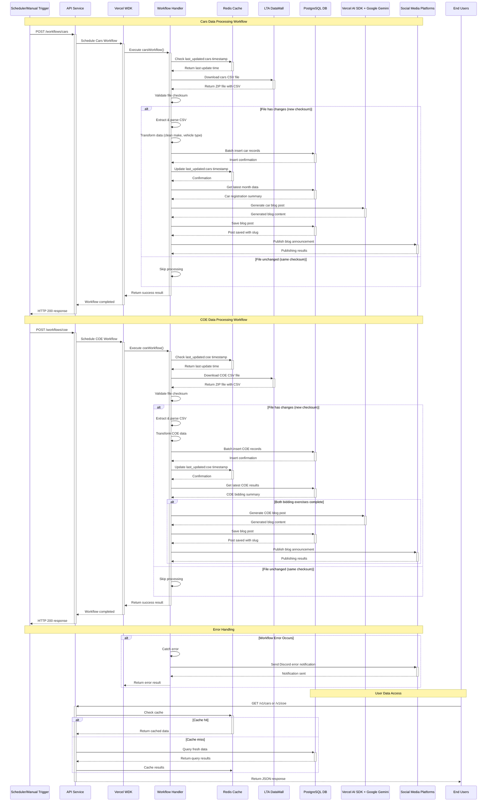

# Data Processing Workflows

This document describes the end-to-end data processing workflows that keep the SG Cars Trends platform updated with the latest vehicle registration and COE bidding data.

## Workflow Sequence Diagram

## Workflow Components

### 1. Cars Data Processing Workflow

**Purpose**: Process monthly vehicle registration data from LTA DataMall

**Trigger**: 
- Scheduled: Every hour during business hours (9 AM - 6 PM, Mon-Fri)
- Manual: `POST /workflows/trigger` endpoint

**Process Flow**:

1. **Timestamp Check**: Query Redis for `last_updated:cars` to determine if processing is needed
2. **File Download**: Fetch "Monthly New Registration of Cars by Make.zip" from LTA DataMall
3. **Checksum Validation**: Compare file checksum with previous version to detect changes
4. **Data Extraction**: Extract and parse CSV files if changes detected
5. **Data Transformation**:
   - Clean special characters from make names
   - Normalize vehicle type classifications
   - Convert string numbers to integers
6. **Database Insert**: Batch insert new records with conflict resolution
7. **Cache Update**: Update Redis timestamp for successful processing
8. **Blog Generation**: Create AI-powered blog post analyzing latest data
9. **Social Media**: Announce new blog post across configured platforms

**Data Sources**: `Monthly New Registration of Cars by Make.zip`

**Key Fields Processed**:
- `month`: YYYY-MM format
- `make`: Vehicle manufacturer (normalized)
- `fuel_type`: Petrol, Diesel, Electric, Hybrid
- `vehicle_type`: Cars, Motorcycles, Buses, etc.
- `number`: Registration count

### 2. COE Data Processing Workflow

**Purpose**: Process Certificate of Entitlement bidding results

**Trigger**:
- Scheduled: Every hour during business hours
- Manual: `POST /workflows/trigger` endpoint

**Process Flow**:

1. **Timestamp Check**: Query Redis for `last_updated:coe`
2. **File Download**: Fetch COE bidding results from LTA DataMall
3. **Checksum Validation**: Detect file changes
4. **Data Processing**: Parse COE bidding data and PQP rates
5. **Database Updates**: Insert bidding results and premium rates
6. **Conditional Blog Generation**: 
   - Generate blog posts only when both bidding exercises are complete (`bidding_no = 2`)
   - Provides comprehensive monthly COE analysis
7. **Social Media**: Announce completed bidding results and blog posts

**Data Sources**:
- COE bidding results CSV
- Prevailing Quota Premium (PQP) rates

**Key Fields Processed**:
- `month`: Bidding month
- `bidding_no`: Exercise number (1 or 2)
- `vehicle_class`: COE category
- `quota`: Available certificates
- `bids_received`: Total bids submitted
- `premium`: Winning premium (SGD)

### 3. Blog Generation Workflow

**Purpose**: Create AI-powered market insights from processed data

**AI Integration**: Vercel AI SDK with Google Gemini for content generation

**Content Creation Process**:

1. **Data Analysis**: Analyze latest month's data for trends and insights
2. **Content Generation**: Use LLM to create comprehensive blog posts
3. **Structured Output**: Generate title, content, excerpt, and metadata
4. **SEO Optimization**: Create SEO-friendly slugs and descriptions
5. **Storage**: Save to database with duplicate prevention
6. **Social Distribution**: Announce new content across platforms

**Blog Post Features**:
- Executive summaries with key insights
- Data tables for fuel type and vehicle type breakdowns
- Market trend analysis and implications
- Professional market commentary
- Reading time estimation
- AI attribution and model versioning

### 4. Social Media Integration Workflow

**Purpose**: Distribute updates across multiple social platforms

**Supported Platforms**:
- **Discord**: Webhook-based notifications
- **LinkedIn**: Business-focused updates
- **Telegram**: Channel messaging
- **Twitter**: Social media engagement

**Publishing Flow**:
1. **Platform Validation**: Check configuration for each enabled platform
2. **Parallel Publishing**: Simultaneously post to all configured platforms
3. **Error Handling**: Graceful degradation with Discord error notifications
4. **Result Aggregation**: Collect success/failure statistics

## Error Handling and Reliability

### Redundancy Prevention

**Checksum Validation**: Files are only processed if checksums differ from previous versions
**Timestamp Tracking**: Redis timestamps prevent duplicate processing
**Database Constraints**: Unique key constraints prevent duplicate records

### Error Recovery

**Workflow State**: Vercel WDK maintains workflow state and enables retries
**Discord Notifications**: Failed workflows trigger Discord alerts with error details
**Graceful Degradation**: Social media failures don't block data processing

### Monitoring and Logging

**Vercel Logs**: Comprehensive logging for all workflow steps
**Console Logging**: Prefixed logs for easy filtering (e.g., `[WORKFLOW]`, `[COE]`)
**Error Tracking**: Detailed error messages with context

## Configuration

### Environment Variables

**Core Workflow**:
- `LTA_DATAMALL_API_KEY`: LTA DataMall access
- `DATABASE_URL`: PostgreSQL connection
- `UPSTASH_REDIS_REST_*`: Redis configuration

**AI Integration**:
- `GOOGLE_GENERATIVE_AI_API_KEY`: Google Gemini API key (used by Vercel AI SDK)

**Social Media**:
- `LINKEDIN_*`: LinkedIn API credentials
- `TELEGRAM_*`: Bot configuration
- `TWITTER_*`: Twitter API credentials

**Error Reporting**:
- `DISCORD_WEBHOOK_URL`: Workflow error notifications

### Scheduling Configuration

**Vercel Cron Schedule**: `0 10 * * *`
- Daily at 10 AM UTC (6 PM SGT)
- Configured in `apps/web/vercel.json`
- Aligned with LTA DataMall update patterns

## Performance Considerations

### Batch Processing
- Database inserts use batch operations for efficiency
- Large datasets processed in chunks to avoid timeouts

### Caching Strategy
- Redis caching for API responses
- Timestamp-based cache invalidation
- CDN caching for static content

### Resource Optimization
- Vercel Functions with configurable timeouts (up to 60s on Pro plan)
- Singapore region (sin1) for low-latency access to Neon database
- Memory allocation optimized for CSV processing

## Related Documentation

- [System Architecture Overview](./system)
- [Database Schema](./database)
- [API Architecture](./api)
- [Social Media Integration](./social)